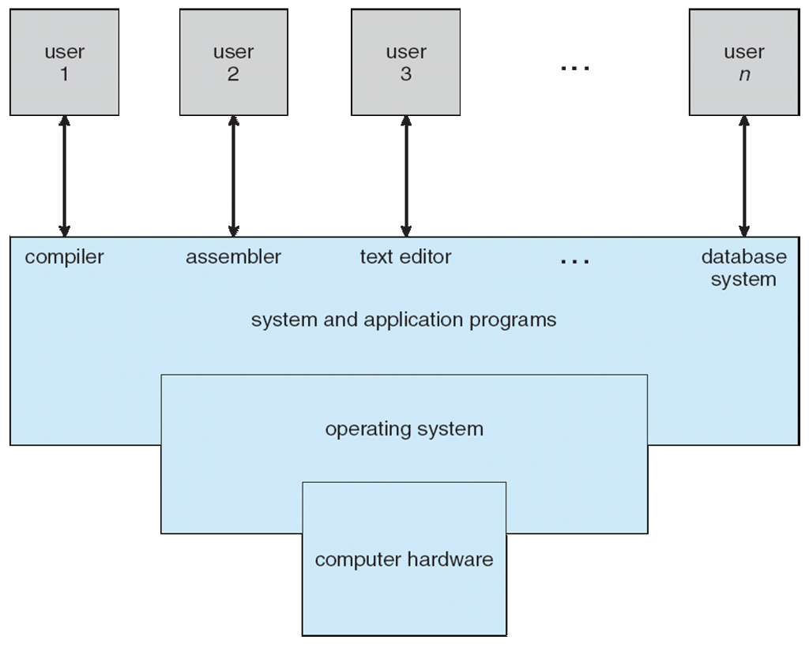
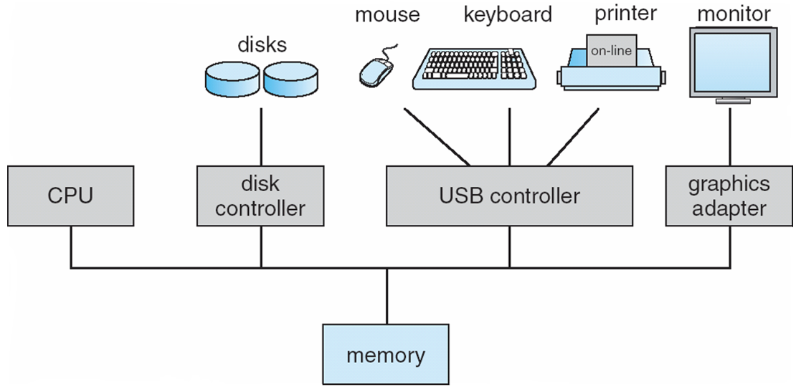
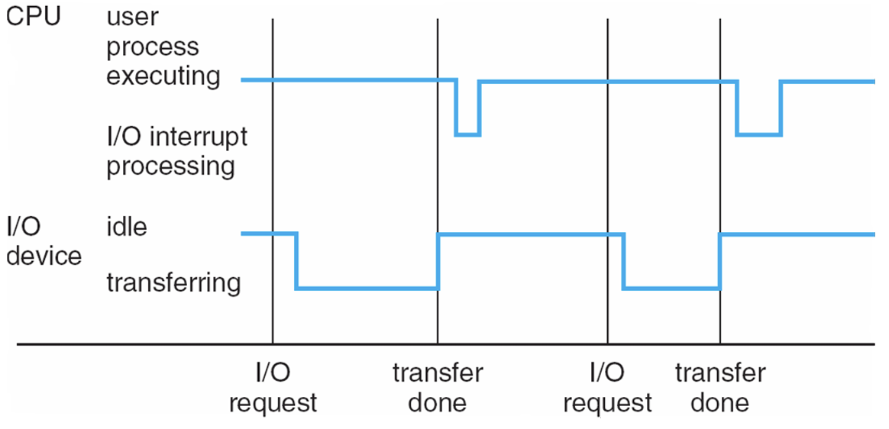
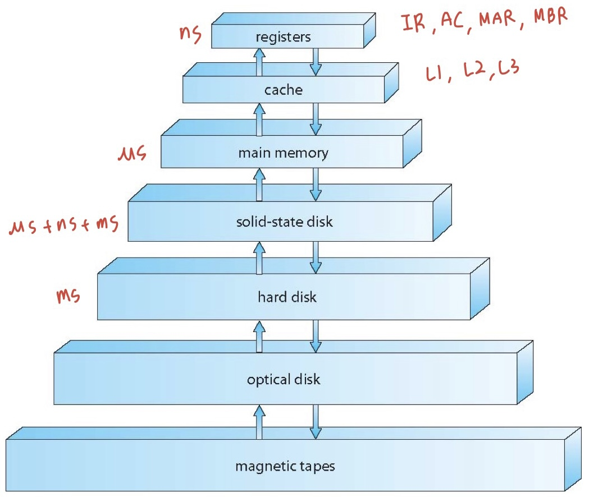
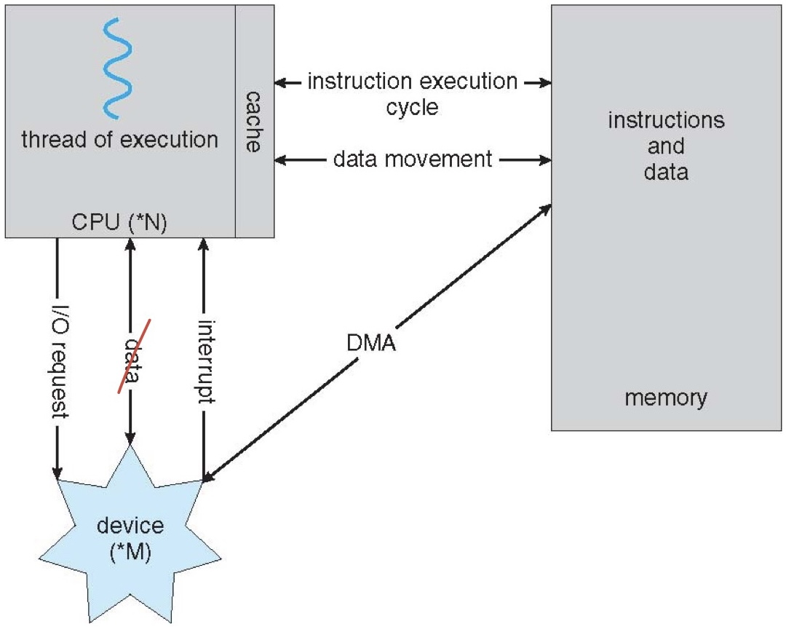

<!-- 2022.03.07 ~ -->

## Chapter 1: Introdution

- What Operating Systems DO
- Computer-System Organization
- Computer-System Architecture
- Operating-System Structure
- Operating-System Operations
- Process Management
- Memory Menagement
- Storage Management
- Protection and Security
- Kernel Data Structures
- Computing Environments
- Open-Source Oprating Systems

## Objectives

- 컴퓨터 시스템의 기본 구성을 설명하는 방법
- 운영 체제의 주요 구성 요소를 자세히 살펴보기
- 다양한 유형의 컴퓨팅 환경에 대한 개요 제공
- 여러 오픈 소스 운영 체제를 탐색
- `Process: 실행 중인 프로그램`
- `Processor: H/W, CPU`

## What is an Operating System?

- 시스템 사용자와 시스템 하드웨어 사이의 중간 역할을 하는 프로그램
- 운영 체제의 목표
  - 사용자 프로그램 실행 및 사용자 문제 해결 용이
  - 컴퓨터 시스템을 편리하게 사용
  - 컴퓨터 하드웨어를 효율적으로 사용

## Computer System Structure

- 컴퓨터 시스템은 네 가지 요소로 나눌 수 있음
  - 하드웨어(Hardware)
    - 기본 컴퓨팅 리소스를 제공
    - CPU, memory, I/O devices
  - 운영 체제(OS: Operating System)
    - 다양한 응용프로그램 및 사용자 간의 하드웨어 사용 제어 및 조정
  - 어플리케이션 프로그램(Application Programs)
    - 사용자의 컴퓨팅 문제를 해결하기 위해 시스템 자원이 사용되는 방법을 정의
    - Word processorsm compilers, web browsers, database systems, video games
  - 사용자(Users)
    - People, machines, other computers

## Four Components of a Computer System

## What Operating Systems Do

- 관점에 따라 다름
- 사용자는 편의성, **사용 편의성** 및 **우수한 성능**을 원함
  - 리소스는 신경쓰지 않음
- 그러나 **메인프레임**이나 **미니컴퓨터**와 같은 공유 컴퓨터는 모든 사용자를 행복하게 해야 함
- **워크스테이션**과 같은 전용 시스템의 사용자는 전용 리소스를 가지고 있지만 **서버**의 공유 리소스를 자주 사용
- 휴대용 컴퓨터는 가용성과 배터리 수명에 최적화되어 있어 리소스가 부족
- 일부 컴퓨터에는 장치 및 자동차에 내장된 컴퓨터와 같은 사용자 인터페이스가 거의 또는 전혀 없음

## Operating System Definition

- OS는 **리소스 할당자**
  - 모든 리소스를 관리
  - 효율적인 리소스 사용과 공정한 리소스 사용에 대한 상반된 요청 사이에서 결정
- OS는 **컨트롤 프로그램**
  - 프로그램 실행을 제어하여 오류 및 컴퓨터의 부적절한 사용을 방지
- 보편적으로 허용되는 정의가 없음
- 좋은 근사치: 운영 체제를 주문할 때 공급업체가 제공하는 모든 것
  - 하지만 매우 다양함
- **커널(kernel)**: 컴퓨터에서 항상 실행되는 프로그램
  - 항상 메인 메모리에 존재
- 다른 모든 것들은 둘 중 하나
  - 시스템 프로그램(운영 체제와 함께 제공)
  - 어플리케이션 프로그램

## Computer Startup

- 전원을 켜거나 재부팅할 때 **부트스트랩 프로그램**이 로드
  - 일반적으로 ROM 또는 EPROM에 저장되며 일반적으로 **펌웨어**라고 함
  - 시스템의 모든 측면을 초기화
  - 운영 체제 커널을 로드하고 실행을 시작

## Computer System Organization

- 컴퓨터 시스템 작동
  - 하나 이상의 CPU, 장치 컨트롤러가 공통 버스를 통해 연결되어 공유 메모리에 대한 액세스를 제공
  - 메모리 주기 동안 경쟁하는 CPU 및 장치의 동시 실행

## Computer-System Operation

- I/O 디바이스와 CPU를 동시에 실행할 수 있음
- 각 장치 컨트롤러는 특정 장치 유형을 담당
- 각 장치 컨트롤러에는 로컬 버퍼가 있음
- CPU가 데이터를 기본 메모리로/ 부터 로컬 버퍼부터/로 이동
- I/O가 디바이스에서 컨트롤러의 로컬 버퍼로 전송
- 디바이스 컨트롤러가 **인터럽트**를 발생시켜 작업이 완료되었음을 CPU에 알림

## Common Functions of Interrupts

- 인터럽트는 일반적으로 모든 서비스 루틴의 주소를 포함하는 **인터럽트 벡터**를 통해 인터럽트 서비스 루틴으로 제어를 전송
- 인터럽트 아키텍처는 인터럽트된 명령의 주소를 저장해야 함
- **트랩** 또는 **예외**는 오류 또는 사용자 요청에 의해 발생하는 소프트웨어 생성 인터럽트
- 운영 체제는 **인터럽트 기반**

## Interrupt Handling

- 운영 체제는 **레지스터와 프로그램 카운터를 저장**하여 CPU의 상태를 유지
- 발생한 인터럽트 유형을 결정
  - **polling**
  - **vectored** interrupt system
- 코드의 개별 세그먼트는 각 인터럽트 유형에 대해 수행해야 할 작업을 결정

## Interrupt Timeline

## I/O Structure

- I/O가 시작된 후에는 I/O 완료 시에만 제어가 사용자 프로그램으로 돌아감
  - 대기 명령은 다음 인터럽트까지 CPU를 유휴 상태로 만듬
  - 대기 루프(메모리 액세스에 대한 경합)
  - 한 번에 하나의 I/O 요청이 미결 상태이며, 동시 I/O 처리가 불가능
- I/O가 시작되면 I/O가 완료될 때까지 기다리지 않고 제어가 사용자 프로그램으로 돌아감
  - **시스템 호출**: 사용자가 I/O 완료를 기다릴 수 있도록 OS에 요청
  - **디바이스 상태 테이블**에는 유형, 주소 및 상태를 나타내는 각 I/O 디바이스의 항목이 포함
  - 장치 상태를 확인하고 인터럽트를 포함하도록 테이블 항목을 수정하기 위해 OS 인덱스를 I/O 장치 테이블에 넣음

## Storage Definitions and Notation Review

- 1byte = 8bits
- 1word = 32bits/64bits
- 1kilobyte(KB) = 1,024 bytes
- 1megabyte(MB) = 1,024^2 bytes
- 1gigabyte(GB) = 1,024^3 bytes
- 1terabyte(TB) = 1,024^4 bytes
- 1petabyte(PB) = 1,024^5 bytes

## Storage Structure

- Main memory(RAM): CPU가 직접 액세스할 수 있는 대용량 저장 미디어만
  - **Random accesss**
  - Typically **volatile**
    - volatile: 전원 종료시 메모리 소멸
- Secondary storage: 대용량 비휘발성 스토리지 용량을 제공하는 기본 메모리 확장
  - nonvolatile: 전원 종료시 메모리 유지
- Hard disks(HDD): 자기 기록 물질로 덮인 단단한 금속 또는 유리 플래터
  - 디스크 표면은 논리적으로 **tracks**으로 나뉘며 **sectors**로 세분
  - **디스크 컨트롤러**가 장치와 컴퓨터 간의 논리적 상호 작용을 결정
  - 용어 정리
    - seek time: track을 찾는 시간
    - rotational delay: sector의 시작 부분을 header로 이동 시키는 시간
    - trasmission time
- **Solid-state disks(SDD)**: 하드 디스크보다 빠른 속도, 비휘발성
  - 다양한 기술
  - 점점 더 인기를 얻고 있음

## Storage Hierarchy

- 계층 구조로 구성된 스토리지 시스템
  - Speed
  - Cost
  - Volatility(휘발성)
- **Caching**: 더 빠른 스토리지 시스템으로 정보 복사, 기본 메모리는 보조 스토리지를 위한 캐시로 볼 수 있음
- I/O를 관리할 각 장치 컨트롤러용 **장치 드라이버**
  - 컨트롤러와 커널 간에 균일한 인터페이스를 제공

## Storage-Device Hierarchy

## Caching

- main memory와 CPU 사이의 속도 차이를 줄이기위해 사용
- 컴퓨터의 여러 수준에서 수행되는 중요한 원칙(하드웨어, 운영 체제, 소프트웨어)
- 사용 중인 정보가 저속 스토리지에서 고속 스토리지로 일시적으로 복사됨
  - locality(지역성)
    - temporal locality(시간성)
    - spatial locality(공간성)
- 더 빠른 스토리지(캐시)를 먼저 확인하여 정보가 있는지 확인
  - 사용 가능한 경우 캐시에서 직접 사용되는 정보(빠른 속도)
  - 그렇지 않으면 데이터가 캐시에 복사되어 캐시에서 사용
- 캐시 중인 스토리지보다 작은 캐시
  - 캐시 관리 중요 설계 문제
  - 캐시 크기 및 교체 정책
- `cache hit/miss`: 캐시안에 데이터가 있는/없는 경우
- `Hit ratio`: hit가 발생되는 비율, 높을수록 좋은 캐시
- cache replacement = write-behind(back) = write-through

## Direct Memory Access Structure(DMA)

- 메모리 속도에 가까운 속도로 정보를 전송할 수 있는 고속 I/O 장치에 사용
- 장치 컨트롤러가 CPU 개입 없이 버퍼 스토리지에서 메인 메모리로 데이터 블록을 직접 전송
- byte당 interrupt가 아닌 **블록당 하나의 interrupt만 생성**

## How a Modern Computer Works

