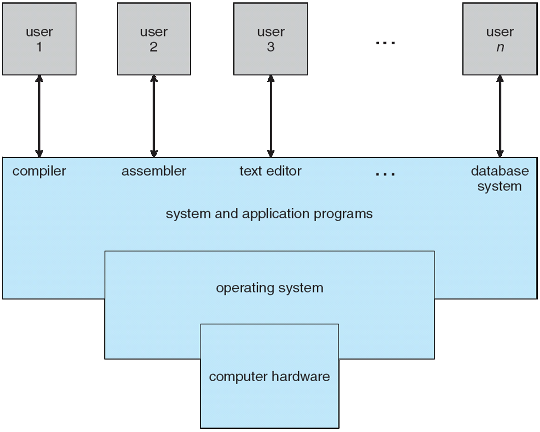
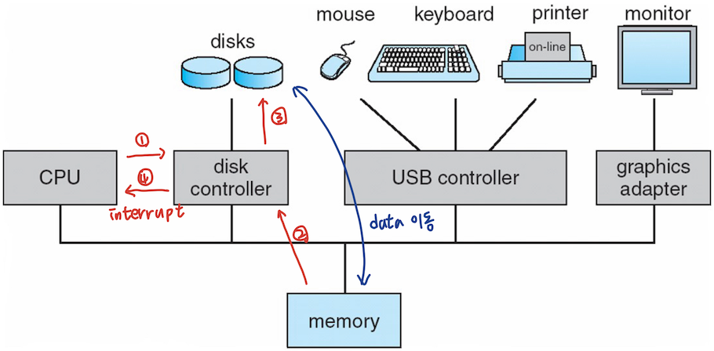
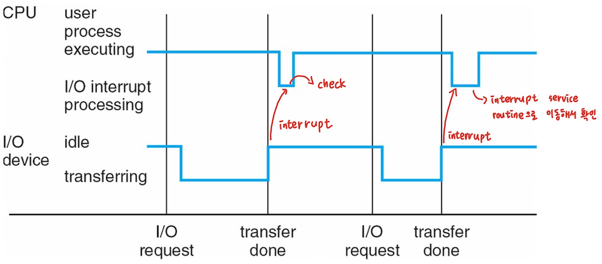
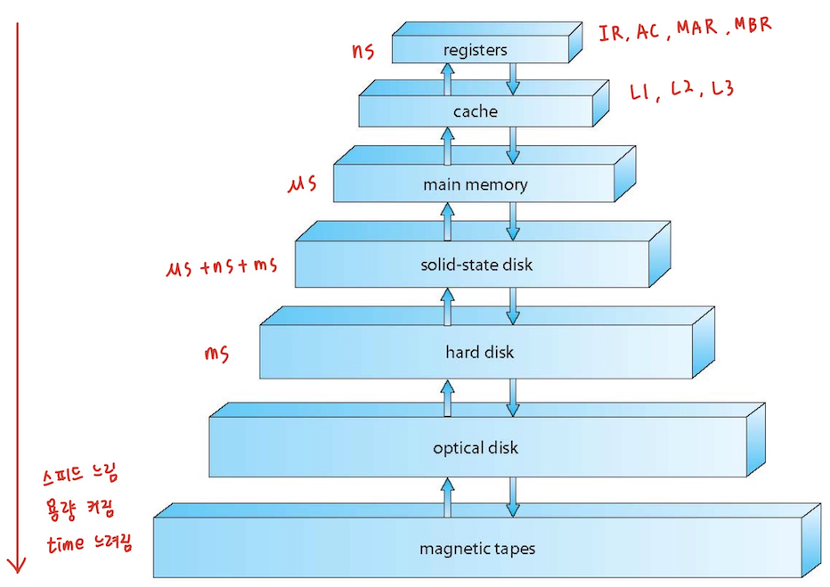
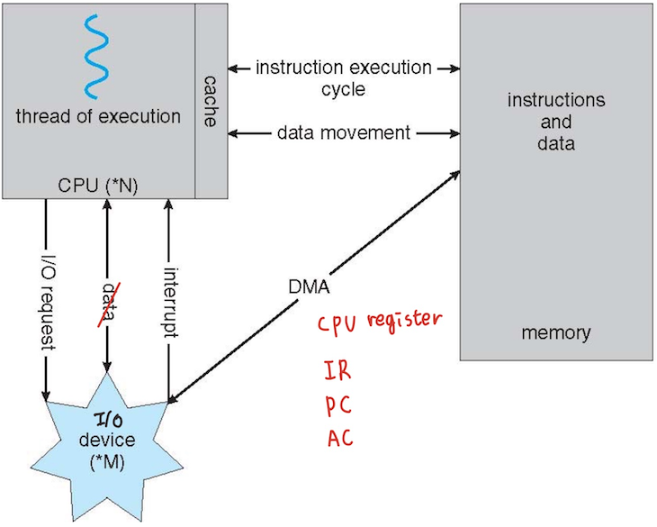

# Chapter 1: Introduction

## Objectives

- Process: 실행중인 프로그램(S/W)
- Processor: H/W(CPU, GPU, I/O processor)

## OS(Operating System)은 무엇일까?

- OS: CPU, I/O, memory를 작동시키는 프로그램
- user와 H/W 사이의 중개 역할을 하는 프로그램
  -  user와 H/W 사이에 존재하는 S/W
- OS의 목표
  - 사용자 프로그램을 실행하여 사용자 문제를 쉽게 해결
  - 컴퓨터 시스템을 사용하기 쉽게 하는 것
  - 컴퓨터 하드웨어를 효율적으로 사용

## 컴퓨터 시스템 구조

- 컴퓨터 시스템은 4개의 컴포넌트로 나눌 수 있음
  - Hardward: 기본적인 컴퓨팅 리소스 제공
    - CPU, memory, I/O device
  - Operating System(S/W)
    - 다양한 애플리케이션 및 사용자 간의 하드웨어 사용 제어 및 조정
  - Application programs: 사용자의 컴퓨팅 문제를 해결하기 위해 시스템 리소스를 사용하는 방법의 정의
    - 워드 프로세서, 컴파일러, 웹브라우저, 데이터베이스 시스템, 비디오 게임
  - Users
    - 사람, 기계, 기타 컴퓨터

## 컴퓨터 시스템의 4가지 컴포넌트

## 운영 체제의 기능

- 사용자는 편리성, `사용 편의성`, `뛰어난 퍼포먼스`를 원함
  - `자원 사용률`에 무관심
  - resource: CPU, memory, I/O device
- 그러나 `mainframe(슈퍼컴퓨터)`이나 `minicomputer`와 같은 공유 컴퓨터는 모든 사용자를 만족시켜야 함
- `workstations` 등의 전용 시스템 사용자는 전용 리소스를 가지고 있지만, `서버`의 공유 리소스를 자주 사용
- handheld 컴퓨터는 자원 부족, 조작성 및 배터리 지속 시간 최적화
- 기기나 자동차에 내장된 컴퓨터 등 사용자 인터페이스가 거의 없거나 아예 없는 컴퓨터도 있음

## 운영 체제의 정의

- OS는 `resource allocator`
  - 모든 자원 관리
  - 효율적인 자원 사용과 공정한 자원 사용에 대한 상충되는 요구 사이에서 결정
- OS는 `control program`
  - 오류 및 컴퓨터 부적절한 사용을 방지하기 위해 프로그램 실행을 제어
- 일반적으로 받아들여지는 정의가 없음
- `kernel`: 컴퓨터 시스템을 시작해서 다운될 때까지 항상 main memory 안에 존재해야하는 부분
  - kernel이 빨라야 프로그램 수행이 빨라짐

## Computer Startup

- `boorstrap program`은 전원을 켜거나 재부팅할 때 로드
  - 일반적으로 ROM또는 EPROM에 저장되며, 일반적으로 `firmware`로 알려져 있음
  - 시스템의 모든 측면을 초기화
  - 운영 제제 커널을 로드하고 실행을 시작

## 컴퓨터 시스템 구성

- 컴퓨터 시스템 조작
  - 1개 이상의 CPU, device controller가 공통 버스를 통해 접속되어 공유 메모리에 액세스 가능
  - 메모리 사이클 경합 CPU 및 device 동시 실행
- device driver: 각각의 device를 컨트롤하는 S/W

## 컴퓨터 시스템 조작

- I/O device와 CPU를 동시에 실행할 수 있음
- 각 디바이스 컨트롤러는 특정 디바이스 유형을 담당
- 각 디바이스 컨트롤러에는 로컬 버퍼가 있음
- CPU가 메인 메모리에서 로컬 버퍼로 데이터를 이동시킴
- I/O는 디바이스에서 컨트롤러의 로컬 버퍼로 이동
- 디바이스 컨트롤러가 CPU에 `interrupt`를 발생시켜 동작을 완료했음을 알림

## interrupt의 일반적인 기능

- interrupt는 일반적으로 모든 서비스 루틴의 주소를 포함하는 `interrupt vector`를 통해 interrupt service routine(handler)으로 제어를 전송
  - interrupt service routine(handler): interrupt를 처리하기 위한 루틴
  - interrupt vector: interrupt가 발생했을 때 모든 interrupt 서비스 루틴의 start address를 포함하고 있는 data structure
- interrupt 아키텍처는 인터럽트된 명령의 주소를 저장해야 함
- `trap` 또는 `exception`은 오류 또는 사용자 요청에 의해 발생한 소프트웨어 생성 인터럽트
- 운양체제는 `interrupt driven`

## 인터럽트 처리

- 운영체제는 레지스터와 프로그램 카운터를 저장하여 CPU 상태를 유지
- 발생한 인터럽트 유형을 판별
  - `polling`: CPU가 주기적으로 디바이스 상태를 체크하는 것
  - `벡터` 인터럽트 시스템
- 코드 세그먼트에 따라 인터럽트 유형별로 수행할 액션이 결정

## 인터럽트 타임라인

## I/O 구조

- I/O가 시작된 후, I/O가 완료되었을 때만 컨트롤이 사용자 프로그램으로 돌아감
  - 대기 명령은 다음 인터럽트까지 CPU가 유휴 상태로 만듬
  - 대기 루프(메모리 액세스 경합)
  - 한 번에 최대 1개의 I/O 요청이 처리되지 않고, 동시에 처리되지 않음
- I/O가 시작되면, I/O 완료를 기다리지 않고 사용자 프로그램으로 제어가 돌아감
  - `*System call`: 사용자가 I/O 완료를 기다릴 수 있도록 OS에 요청(read, write)
  - `디바이스 상태 테이블`에는 type, address, state를 나타내는 각 I/O 디바이스의 엔트리가 포함됨
  - 디바이스의 상태를 확인하고 인터럽트를 포함하도록 테이블 엔트리를 수정하기 위해 OS 인덱스를 I/O 디바이스 테이블로 변환

## 스토리지 정의 및 표기

- 1 byte = 8 bits
- 1 word = 32 bits, 64 bits
- 1 kilobyte(KB) = 2^10 bytes
- 1 megabyte(MB) = 2^20 bytes
- 1 gigabyte(GB) = 2^30 bytes
- 1 terabyte(TB) = 2^40 bytes
- 1 petabyte(PB) = 2^50 bytes

## 스토리지 구조

- Main memory: CPU가 직접 액세스할 수 있는 대용량 스토리지 미디어만
  - `랜덤 액세스`
  - 보통 `휘발성(volatile)`
    - volatile: 전원 off -> 메모리 소멸
- Secondary storage: 대용량 비휘발성(`nonvolatile`) 스토리지 용량을 제공하는 메인 메모리 확장
  - nonvolatile: 전원 off -> 메모리 유지, 속도가 느림(HDD, SSD)
- 하드 디스크 - 자기 기록 재료로 덮힌 견고한 금속 또는 유리 플래터
  - 디스크 표면이 논리적으로 `tracks`으로 분할되고, tracks이 `sectors`로 분할
  - `디스크 컨트롤러`는 디바이스와 컴퓨터 간의 논리적 상호 작용을 결정
- `Solid-state disks(SSD)`: 하드 디스크보다 고속, 비휘발성
  - 다양한 테크놀로지
  - 인기가 높아짐
- 추가
  - seek time: data가 저장된 track을 찾는 시간
  - rotational delay: sector의 시작 부분을 header로 이동시키는 시간
  - trasmission time: 해당 data를 memory로 옯기는 시간
  - 일반적으로 data는 sector 단위로 전달

## 스토리지 계층

- 계층 구조로 구성된 스토리지 시스템
  - 속도
  - 비용
  - 변동성(volatility)
- `caching`: 정보를 고속 스토리지 시스템에 복사, 메인 메모리는 세컨더리 스토리지의 캐시로 간주할 수 있음
  - H/W 캐시: CPU와 메인 메모리 사이에 존재하는 캐시
- I/O를 관리하는 각 디바이스 컨트롤러용 `디바이스 드라이버(S/W)`
  - 컨트롤러와 커널 간의 통일된 인터페이스 제공

## 스토리지 디바이스 계층

## 캐싱

- 중요한 원칙, 컴퓨터(하드웨어, 운영체제, 소프트웨어)에서 여러 레벨로 실행됨
- 사용 중인 정보가 일시적으로 저속 저장소에서 고속 저장소로 복사됨
- 먼저 스토리지(캐시)를 체크하여 정보가 존재하는지 확인
  - 이 경우 캐시에서 직접 사용되는 정보(고속)
  - 그렇지 않은 경우 데이터를 캐시에 복사하여 캐시에 사용
- 캐시되는 스토리지보다 작은 캐시
  - 캐시 관리의 중요한 설계 문제
  - 캐시 크기 및 교체 정책
- Hit ratio: 캐시안에 원하는 데이터가 저장되어있을 비율, hit가 발생되는 비율, 높을수록 좋은 캐시
- cache hit/miss: 캐시안에 원하는 데이터가 있/없는 경우
- 추가
  - 메인 메모리와 CPU 사이의 속도 차이를 줄이기 위해 사용
  - locality(지역성): 가음에 시행될 가능성이 큰 데이터들을 캐시안에 저장
    - temporal locality(시간성)
    - spatial locality(공간성)
  - penalty: 캐시안에 있는 데이터를 사용하지 않아서 발생하는 overhead -> cache miss
  - cache replacement = write-behind(back) = write-through
    - 캐시의 공간이 작기떄문에 메인 메모리로부터 cache miss인 경우에 데이터를 가져오기 위해서 캐시에 빈 공간을 마련 후 메인 메모리로부터 새로운 데이터를 캐시안에 저장

## Direct Memory Access 구조

- 메모리 속도에 가까운 속도로 정보를 전송할 수 있는 고속 I/O 디바이스에 사용
- 디바이스 컨트롤러는 CPU 개입 없이 데이터 블록을 버퍼 스토리지에서 메인 메모리로 직접 전송
- 바이트당 인터럽트가 아닌 `블록당 인터럽트라 1개`만 생성
- DMA: CPU에 간섭없이 메인 메모리와 I/O 디바이스의 사이에서 block 단위로 직접 데이터를 전달하는 스컴

## 최신 컴퓨터 구조

