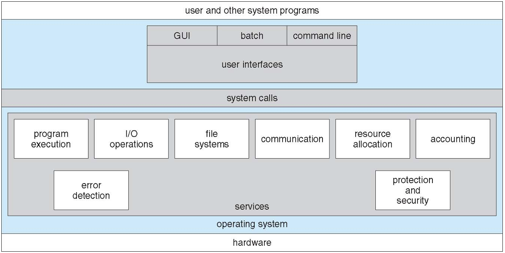
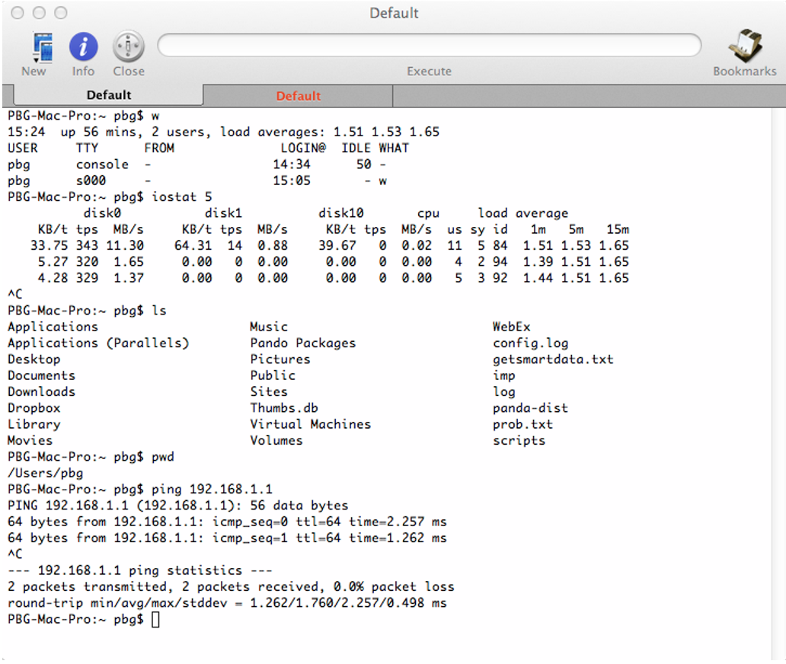

# Chapter 2: Operating-System Structures

## 운영체제 서비스

- 운영체제는 프로그램과 서비스를 실행할 수 있는 환경을 프로그램과 사용자에게 제공
- 사용하기 쉬운 기능을 제공하는 운영체제 서비스 세트
  - 사용자 인터페이스 - 거의 모든 운영체제에는 사용자 인터페이스(`UI`)가 있음
    - 배치에 따라 `명령줄(CLI), 그래픽스 사용자 인터페이스(GUI)`
  - 프로그램 실행 - 시스템은 프로그램을 메모리에 로드하고 실행할 수 있어야하며 프로그램을 정상 또는 비정상적으로 종료해야 함(오류 표시)
  - I/O 작동 - 실행 중인 프로그램에 I/O가 필요할 수 있으며 파일 또는 I/O 장치가 필요할 수 있음
  - 파일 시스템 조작 - 파일 시스템이 특히 중요함. 프로그램은 파일 및 디렉토리를 읽고 쓰고, 작성 및 삭제하고, 검색하며, 파일 정보를 나열하고, 권한을 관리해야 함
  - 통신 - 프로세스는 같은 컴퓨터 또는 네트워크를 통해 컴퓨터 간에 정보를 교환할 수 있음
    - 통신은 공유 메모리 또는 메시지 전달을 통해 이루어짐(OS에 의해 패킷이 이동됨)
  - 오류 검출 - OS는 발생할 수 있는 오류를 항상 인식해야 함
    - CPU 및 메모리 하드웨어, I/O 디바이스, 사용자 프로그램에서 발생할 수 있음
    - 각 유형의 오류에 대해 OS는 적절하고 일관된 컴퓨팅을 보장하기 위해 적절한 조치를 취해야 함
    - 디버깅 기능은 사용자와 프로그래머의 시스템 사용 능력을 크게 향상시킬 수 있음
- 자원 공유를 통해 시스템 자체의 효율적인 운영을 보장하기 위한 다른 일련의 OS 기능이 존재
  - 리소스 할당 - 여러 사용자 또는 여러 작업을 동시에 실행하는 경우 리소스를 각 사용자에게 할당해야 함
    - CPU 사이클, 메인 메모리, 파일 스토리지, I/O 디바이스 등 다양한 유형의 리소스
  - 회계 - 어떤 사용자가 얼마나 많은 컴퓨터 리소스를 사용하고 어떤 종류의 컴퓨터 리소스를 사용하고 있는지 추적
  - 보호 및 보안 - 멀티 사용자 또는 네트워크 컴퓨터 시스템에 저장된 정보의 소유자는 해당 정보의 사용을 제어할 수 있음. 동시 프로세스는 서로 간섭하지 않음
    - 보호에는 시스템 리소스에 대한 모든 액세스가 제어되는 것이 포함
    - 외부인으로부터 시스템을 보호하려면 사용자 인증이 필요. 또한 외부 I/O 디바이스를 부정 액세스 시도로부터 보호

## 운영체제 서비스 표시

## 사용자 운영체제 인터페이스 - CLI

- CLI 또는 `명령어 인터프린터`가 명령어를 직접 입력할 수 있음
  - 커넬에 구현되는 경우도 있고 시스템 프로그램에 의해 구현되는 경우도 있음
  - 여러 가지 맛이 구현될 수 있음 - `shell`
  - 주로 사용자로부터 명령을 가져와 실행
  - 명령어가 내장되어 있는 경우도 있고 프로그램 이름만 있는 경우도 있음
    - 후자의 경우 새로운 기능을 추가할 때 shell을 변경할 필요가 없음

## Bourne Shell Command Interpreter

## 사용자 운영체제 인터페이스 - GUI

- 사용하기 쉬운 `데스크탑` metaphor 인터페이스
  - 보통 마우스, 키보드 및 모니터
  - `아이콘`은 파일, 프로그램, 액션 등을 나타냄
  - 인터페이스의 오브젝트 위에 있는 다양한 마우스 버튼에 의해 다양한 액션(정보 제공, 옵션, 실행 기능, 오픈 디렉토리(`폴더`라고 불림))이 발생
  - Xerox PARC에서 개발
- 현재 많은 시스템에 CLI 인터페이스와 GUI 인터페이스가 모두 탑재되어 있음
  - Microsoft Windows는 CLI "command" 쉘을 탑재한 GUI
  - Apple Mac OS X는 "Aqua" GUI 인터페이스로 UNIX 커널이 아래에 있고 쉘이 있음
  - Unix 및 Linux에는 옵션 GUI 인터페이스(CDE, KDE, GNOME)가 있는 CLI가 있음

## 시스템 콜

- OS에서 제공하는 서비스에 대한 프로그래밍 인터페이스
- 일반적으로 고급 언어(C 또는 C++)로 작성
- 대부분 시스템에서 직접 호출을 사용하는 것이 아니라 고급 `API(Application Programming Interface)`를 통해 프로그램에 액세스
- 가장 일반적인 3가지 API는 Windows용 Win32 API, POSIX 기반 시스템용 POSIX API(유닉스, Linux 및 Max OS X의 거의 모든 버전을 포함), Java Virtual Machine(JVM: Java 가상 머신)용 Java API

