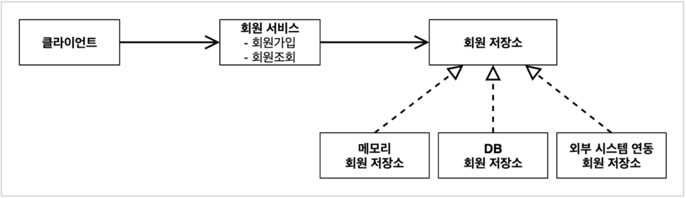
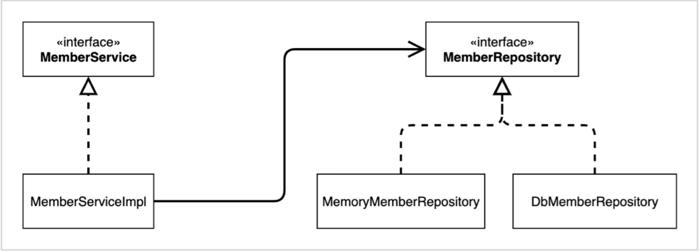
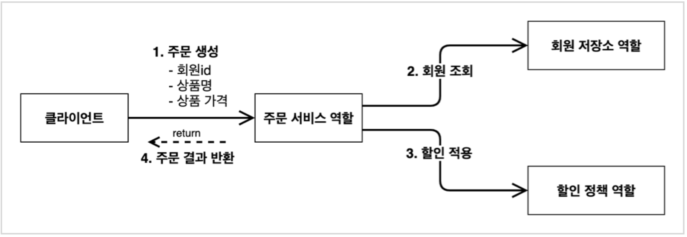
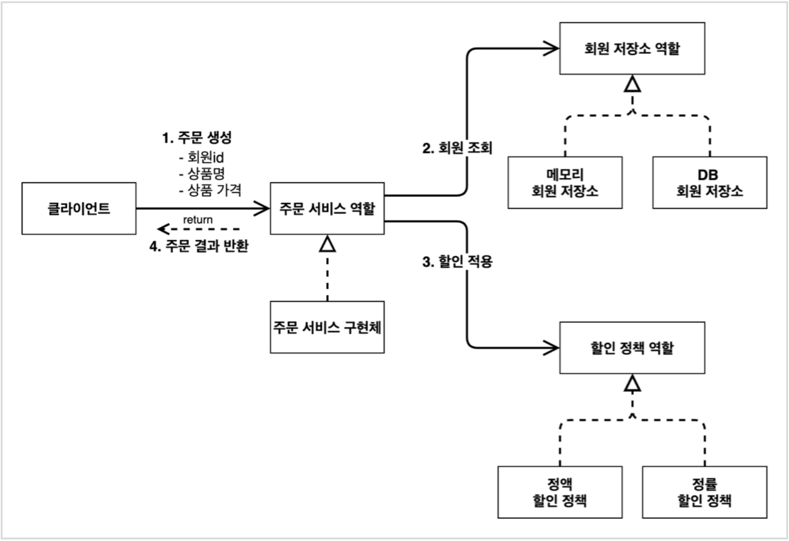
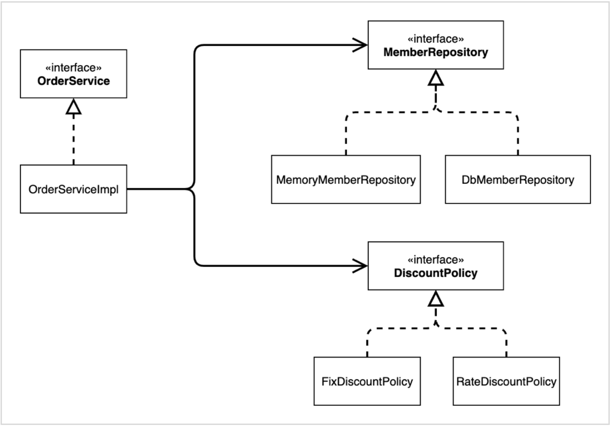
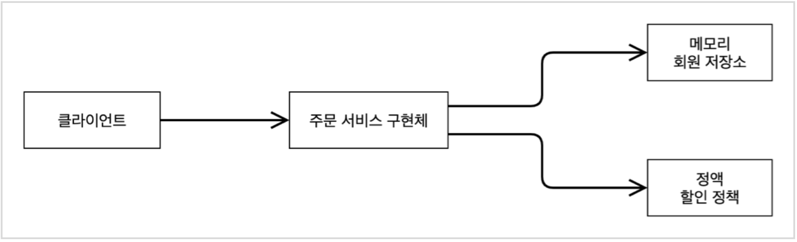
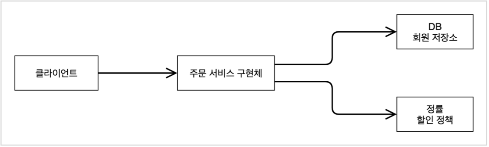

<!-- 2022.02.24 THU -->

## Section 02. 스프링 핵심 원리 이해1 - 예제 만들기

### 프로젝트 생성

#### 사전 준비물

- Java 11 설치
- IDE: IntelliJ 또는 Eclipse 설치

#### 스프링 부트 스타터 사이트로 이동해서 스프링 프로젝트 생성

- https://start.spring.io

- 프로젝트 선택
  - Project: Gradle Project
  - Spring Boot: 2.5.10
  - Language: Java
  - Packaging: Jar
  - Java: 11
- Project Metadata
  - groupId: hello
  - artifactId: core
- Dependencies: 선택하지 않음

#### Gradle 전체 설정

`build.gradle`
```
plugins {
	id 'org.springframework.boot' version '2.5.10'
	id 'io.spring.dependency-management' version '1.0.11.RELEASE'
	id 'java'
}

group = 'hello'
version = '0.0.1-SNAPSHOT'
sourceCompatibility = '11'

repositories {
	mavenCentral()
}

dependencies {
	implementation 'org.springframework.boot:spring-boot-starter'
	testImplementation 'org.springframework.boot:spring-boot-starter-test'
}

tasks.named('test') {
	useJUnitPlatform()
}
```
- 동작 확인
  - 기본 메인 클래스 실행(`CoreApplication.main()`)

#### IntelliJ Gradle 대신에 자바 직접 실행

- 최근 IntelliJ버전은 Gradle을 통해서 실행 하는 것이 기본 설정
  - 실행 속도가 느림
- Preferences -> Build, Execution, Deployment -> Build Tools -> Gradle
  - Build and run using: Gradle -> IntelliJ
  - Run tests using: Gradle -> IntelliJ

### 비즈니스 요구사항과 설계

- 회원
  - 회원을 가입하고 조회할 수 있음
  - 회원은 일반과 VIP 두 가지 등급이 있음
  - 회원 데이터는 자체 DB를 구축할 수 있고, 외부 시스템과 연동할 수 있음(미확정)
- 주문과 할인 정책
  - 회원은 상품을 주문할 수 있음
  - 회원 등급에 따라 할인 정책을 적용할 수 있음
  - 할인 정책은 모든 VIP는 1000원을 할인해주는 고정 금액 할인을 적용(나중에 변경 될 수 있음)
  - 할인 정책은 변경 가능성이 높음. 회사의 기본 할인 정책을 아직 정하지 못했고, 오픈 직전까지 고민을 미루고 싶음. 최악의 경우 할인을 적용하지 않을 수 있음(미확정)

- 요구사항을 보면 회원 데이터, 할인 정책 같은 부분은 지금 결정하기 어려운 부분. 그렇다고 이런 정책이 결정될 때까지 개발을 무기한 기다릴 수도 없음. 우리는 앞에서 배운 객체 지량 설계 방법이 있음
- 인터페이스를 만들고 구현체를 언제든지 갈아끼울 수 있도록 설계

> 참고: 프로젝트 환경설정을 편리하게 하려고 스프링 부트를 사용한 것. 지금은 스프링 없는 순수한 자바로만 개발을 진행한다는 점을 꼭 기억!

### 회원 도메인 설계

- 회원 도메인 요구사
  - 회원을 가입하고 조회할 수 있음
  - 회원은 일반과 VIP 두 가지 등급
  - 회원 데이터는 자체 DB를 구축할 수 있고, 외부 시스템과 연동할 수 있음(미확정)

#### 회원 도메인 협력 관계



#### 회원 클래스 다이어그램



#### 회원 객체 다이어그램


- 회원 서비스: **MemberServiceImpl**

### 회원 도메인 개발

#### 회원 엔티티

##### 회원 등급

```java
package hello.core.member;

public enum Grade {
    BASIC,
    VIP
}
```

#### 회원 엔티티

```java
package hello.core.member;

public class Member {

    private  Long id;
    private String name;
    private Grade grade;

    public Member(Long id, String name, Grade grade) {
        this.id = id;
        this.name = name;
        this.grade = grade;
    }

    public Long getId() {
        return id;
    }

    public void setId(Long id) {
        this.id = id;
    }

    public String getName() {
        return name;
    }

    public void setName(String name) {
        this.name = name;
    }

    public Grade getGrade() {
        return grade;
    }

    public void setGrade(Grade grade) {
        this.grade = grade;
    }
}
```

#### 회원 저장소

##### 회원 저장소 인터페이스

```java
package hello.core.member;

public interface MemberRepository {

    void save(Member member);

    Member findById(Long memberId);
}
```

##### 메모리 회원 저장소 구현체

```java
package hello.core.member;

import java.util.HashMap;
import java.util.Map;

public class MemoryMemberRepository implements MemberRepository{

    private static Map<Long, Member> store = new HashMap<>();

    @Override
    public void save(Member member) {
        store.put(member.getId(), member);
    }

    @Override
    public Member findById(Long memberId) {
        return store.get(memberId);
    }
}
```
- 데이터베이스가 아직 확정이 안됨. 그래도 개발은 진행해야 하니 가장 단순한, 메모리 회원 저장소를 구현해서 우선 개발을 진행
> 참고: `HashMap`은 동시성 이슈가 발생할 수 있음. 이런 경우 `ConcurrentHashMap`을 사용

#### 회원 서비스

##### 회원 서비스 인터페이스

```java
package hello.core.member;

public interface MemberService {

    void join(Member member);

    Member findMember(Long memberId);
}
```

##### 회원 서비스 구현체

```java
package hello.core.member;

public class MemberServiceImpl implements MemberService{

    private final MemberRepository memberRepository = new MemoryMemberRepository();

    @Override
    public void join(Member member) {
        memberRepository.save(member);
    }

    @Override
    public Member findMember(Long memberId) {
        return memberRepository.findById(memberId);
    }
}
```

### 회원 도메인 실행과 테스트

#### 회원 도메인 - 회원 가입 main

```java
package hello.core;

import hello.core.member.Grade;
import hello.core.member.Member;
import hello.core.member.MemberService;
import hello.core.member.MemberServiceImpl;

public class MemberApp {

    public static void main(String[] args) {  // psvm
        MemberService memberService = new MemberServiceImpl();
        Member member = new Member(1L, "memoryA", Grade.VIP);
        memberService.join(member);

        Member findMember = memberService.findMember(1L);
        System.out.println("new member = " + member.getName());  // soutv
        System.out.println("find Member = " + findMember.getName());
    }
}
```
- 애플리케이션 로직으로 이렇게 테스트 하는 것은 좋은 방법이 아님
- JUnit 테스트를 사용

#### 회원 도메인 - 회원 가입 테스트

```java
package hello.core.member;

import org.assertj.core.api.Assertions;
import org.junit.jupiter.api.Test;

public class MemberServiceTest {

    MemberService memberService = new MemberServiceImpl();

    @Test
    void join() {
        // given
        Member member = new Member(1L, "memberA", Grade.VIP);

        // when
        memberService.join(member);
        Member findMember = memberService.findMember(1L);

        // then
        Assertions.assertThat(member).isEqualTo(findMember);
    }
}
```

#### 회원 도메인 설계의 문제점

- 이 코드의 설계상 문제점은 무엇일까?
- 다른 저장소로 변경할 때 OCP 원칙을 잘 준수할까?
- DIP를 잘 지키고 있을까?
- **의존관계가 인터페이스 뿐만 아니라 구현까지 모두 의존하는 문제점이 있음**
  - 주문까지 만들고나서 문제점과 해결 방안을 설명

### 주문과 할인 도메인 설계

- 주문과 할인 정책
  - 회원은 상품을 주문할 수 있음
  - 회원 등급에 따라 할인 정책을 적용할 수 있음
  - 할인 정책은 모든 VIP는 1000원을 할인해주는 고정 금액 할인을 적용(나중에 변경 될 수 있음)
  - 할인 정책은 변경 가능성이 높음. 회사의 기본 할인 정책을 아직 정하지 못했고, 오픈 직전까지 고민을 미루고 싶음. 최악의 경우 할인을 적용하지 않을 수 있음(미확정)

#### 주문 도메인 협력, 역할, 책임


1. **주문 생성**: 클라이언트는 주문 서비스에 주문 생성을 요청
2. **회원 조회**: 할인을 위해서는 회원 등급이 필요. 그래서 주문 서비스는 회원 저장소에서 회원을 조회
3. **할인 적용**: 주문 서비스는 회원 등급에 따른 할인 여부를 할인 정책에 위임
4. **주문 결과 반환**: 주문 서비스는 할인 결과를 포함한 주문 결과를 반환
> 참고: 실제로는 주문 데이터를 DB에 저장하겠지만, 예제가 너무 복잡해 질 수 있어서 생략하고, 단순히 주문 결과를 반환

#### 주문 도메인 전체


- **역할과 구현을 분리**해서 자유롭게 구현 객체를 조립할 수 있게 설계. 덕분에 회원 저장소는 물론이고, 할인 정책도 유연하게 변경할 수 있음

#### 주문 도메인 클래스 다이어그램



#### 주문 도메인 객체 다이어그램1


- 회원을 메모리에서 조회하고, 정액 할인 정책(고정 금액)을 지원해도 주문 서비스를 변경하지 않아도 됨. 역할들의 협력 관계를 그대로 재사용 할 수 있음

#### 주문 도메인 객체 다이어그램2


- 회원을 메모리가 아닌 실제 DB에서 조회하고, 정률 할인 정책(주문 금액에 따라 % 할인)을 지원해도 주문 서비스를 변경하지 않아도 됨
- 협력 관계를 그대로 재사용 할 수 있음

### 주문과 할인 도메인 개발

#### 할인 정책 인터페이스

```java
package hello.core.discount;

import hello.core.member.Member;

public interface DiscountPolicy {

    // @return 할인 대상 금액
    int discount(Member member, int price);
}
```

#### 정액 할인 정책 구현체

```java
package hello.core.discount;

import hello.core.member.Grade;
import hello.core.member.Member;

public class FixDiscountPolicy implements DiscountPolicy{

    private int discountFixAmount = 1000;  // 1000원 할인

    @Override
    public int discount(Member member, int price) {
        if (member.getGrade() == Grade.VIP) {
            return discountFixAmount;
        } else {
            return 0;
        }
    }
}
```
- VIP면 1000원 할인, 아니면 할인 없음

#### 주문 엔티티

```java
package hello.core.order;

public class Order {

    private Long memberId;
    private String itemName;
    private int itemPrice;
    private int discountPrice;

    public Order(Long memberId, String itemName, int itemPrice, int discountPrice) {
        this.memberId = memberId;
        this.itemName = itemName;
        this.itemPrice = itemPrice;
        this.discountPrice = discountPrice;
    }

    public Long getMemberId() {
        return memberId;
    }

    public int calculatePrice() {
        return itemPrice - discountPrice;
    }

    public void setMemberId(Long memberId) {
        this.memberId = memberId;
    }

    public String getItemName() {
        return itemName;
    }

    public void setItemName(String itemName) {
        this.itemName = itemName;
    }

    public int getItemPrice() {
        return itemPrice;
    }

    public void setItemPrice(int itemPrice) {
        this.itemPrice = itemPrice;
    }

    public int getDiscountPrice() {
        return discountPrice;
    }

    public void setDiscountPrice(int discountPrice) {
        this.discountPrice = discountPrice;
    }

    @Override
    public String toString() {
        return "Order{" +
                "memberId=" + memberId +
                ", itemName='" + itemName + '\'' +
                ", itemPrice=" + itemPrice +
                ", discountPrice=" + discountPrice +
                '}';
    }
}
```

#### 주문 서비스 인터페이스

```java
package hello.core.order;

public interface OrderService {
    Order createOrder(Long memberId, String itemName, int itemPrice);
}
```

#### 주문 서비스 구현체

```java
package hello.core.order;

import hello.core.discount.DiscountPolicy;
import hello.core.discount.FixDiscountPolicy;
import hello.core.member.Member;
import hello.core.member.MemberRepository;
import hello.core.member.MemoryMemberRepository;

public class OrderServiceImpl implements OrderService{

    private final MemberRepository memberRepository = new MemoryMemberRepository();
    private final DiscountPolicy discountPolicy = new FixDiscountPolicy();

    @Override
    public Order createOrder(Long memberId, String itemName, int itemPrice) {
        Member member = memberRepository.findById(memberId);
        int discountPrice = discountPolicy.discount(member, itemPrice);

        return new Order(memberId, itemName, itemPrice, discountPrice);
    }
}
```
- 주문 생성 요청이 오면, 회원 정보를 조회하고, 할인 정책을 적용한 다음 주문 객체를 생성해서 반환. **메모리 회원 리포지토리와, 고정 금액 할인 정책을 구현체로 생성**

### 주문과 할인 도메인 실행과 테스트

#### 주문과 할인 정책 실행

```java
package hello.core;

import hello.core.member.Grade;
import hello.core.member.Member;
import hello.core.member.MemberService;
import hello.core.member.MemberServiceImpl;
import hello.core.order.Order;
import hello.core.order.OrderService;
import hello.core.order.OrderServiceImpl;

public class OrderApp {

    public static void main(String[] args) {
        MemberService memberService = new MemberServiceImpl();
        OrderService orderService = new OrderServiceImpl();

        Long memberId = 1L;
        Member member = new Member(memberId, "memberA", Grade.VIP);
        memberService.join(member);

        Order order = orderService.createOrder(memberId, "itemA", 10000);

        System.out.println("order = " + order);
        // System.out.println("order.calculatePrice = " + order.calculatePrice());
    }
}
```

#### 주문과 할인 정책 테스트

```java
package hello.core.order;

import hello.core.member.Grade;
import hello.core.member.Member;
import hello.core.member.MemberService;
import hello.core.member.MemberServiceImpl;
import org.assertj.core.api.Assertions;
import org.junit.jupiter.api.Test;

public class OrderServiceTest {

    MemberService memberService = new MemberServiceImpl();
    OrderService orderService = new OrderServiceImpl();

    @Test
    void createOrder() {
        Long memberId = 1L;
        Member member = new Member(memberId, "memberA", Grade.VIP);
        memberService.join(member);

        Order order = orderService.createOrder(memberId, "itemA", 10000);
        Assertions.assertThat(order.getDiscountPrice()).isEqualTo(1000);
    }
}
```
