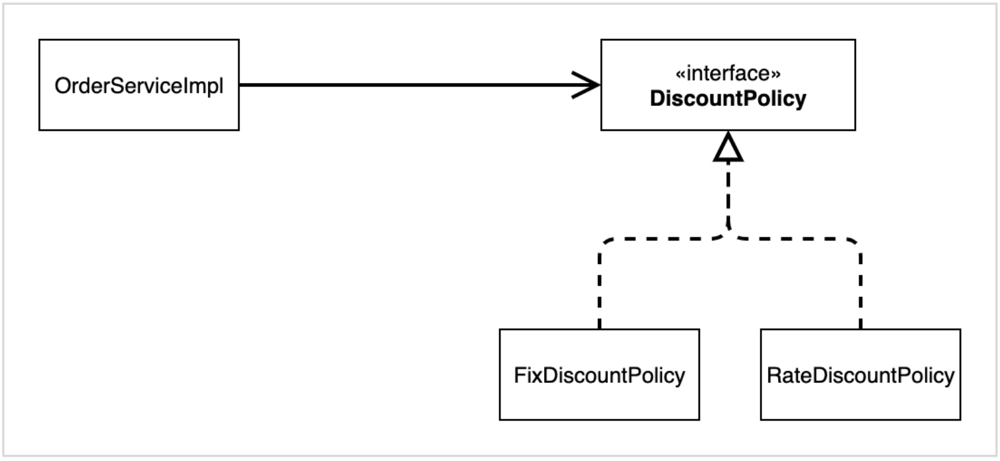
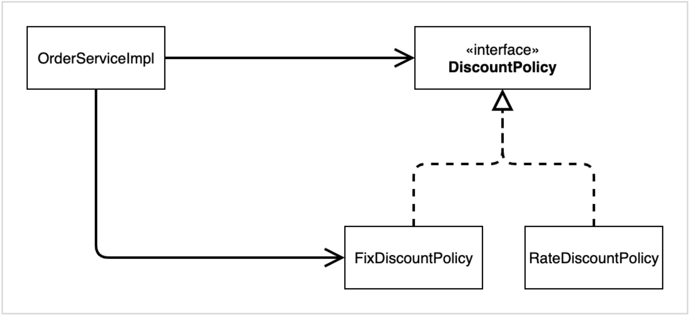
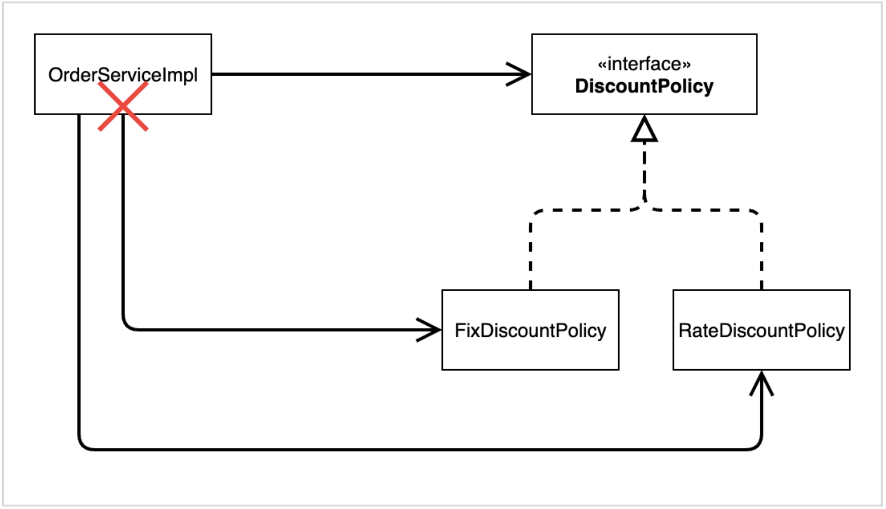
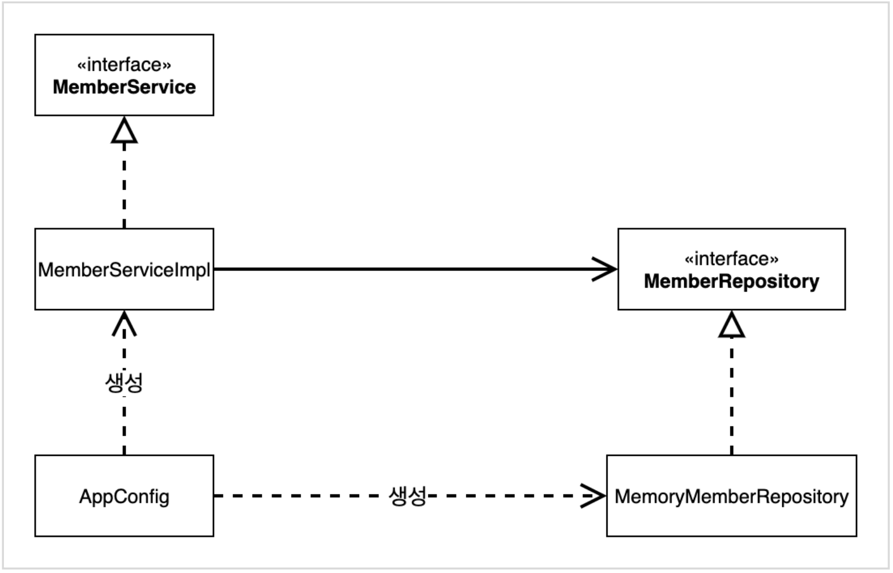
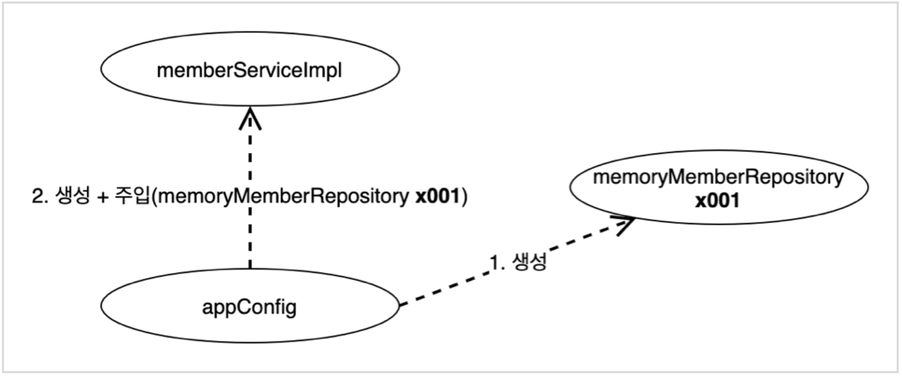
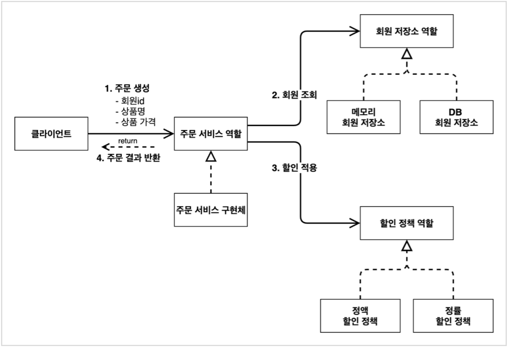
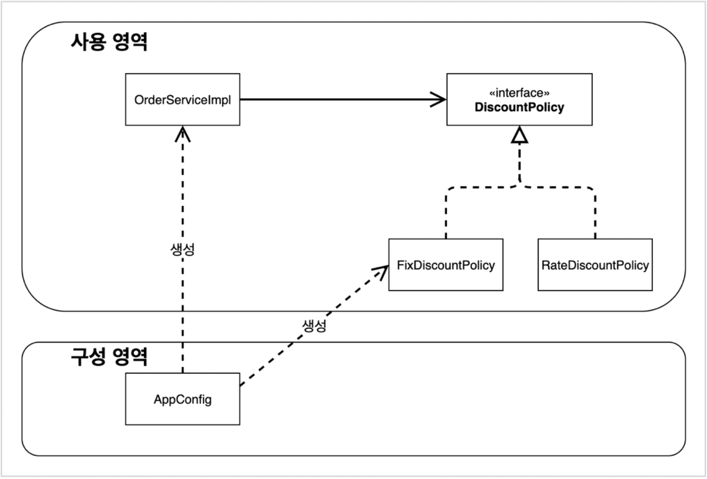
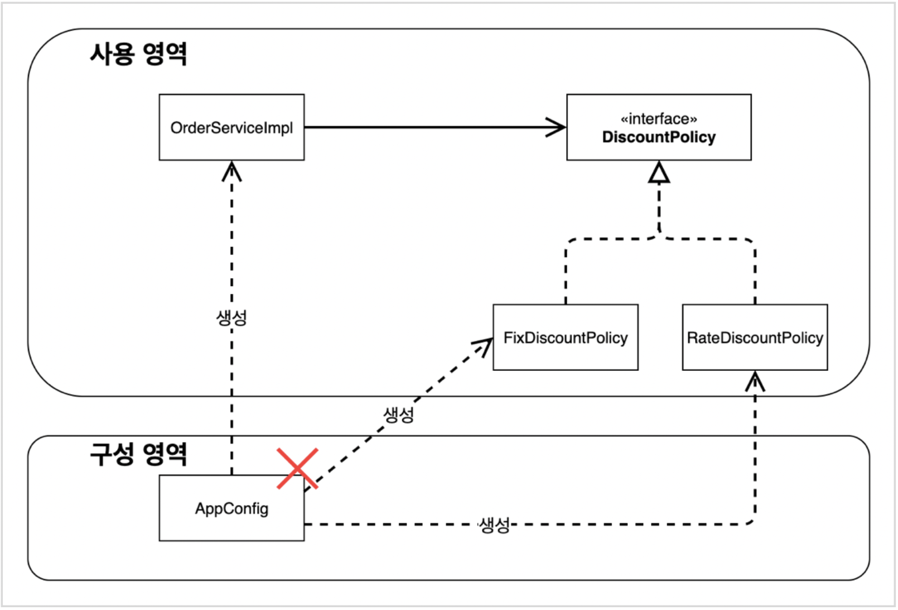
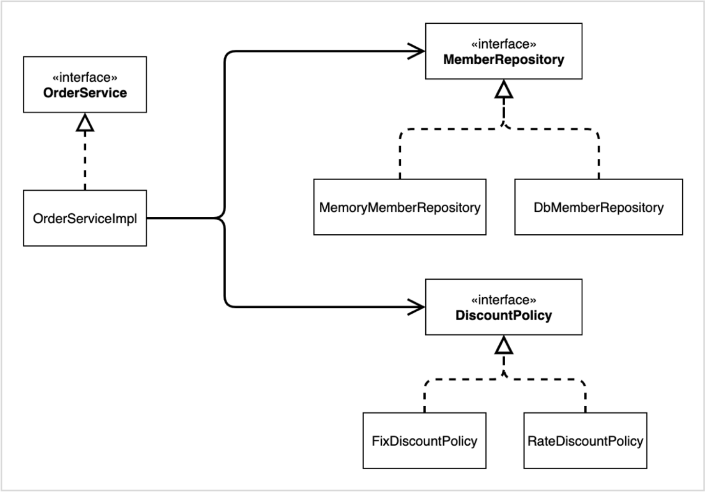
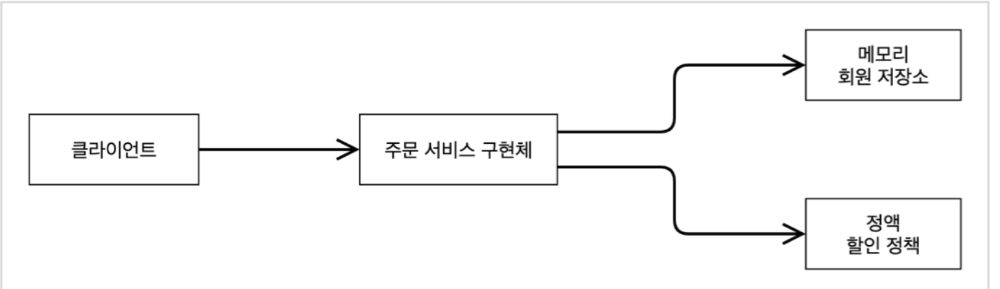

<!-- 2022.02.25 FRI -->

## Section 03. 스프링 핵심 원리 이해2 - 객체 지향 원리 적용

### 새로운 할인 정책 개발

#### 새로운 할인 정책을 확장

> 참고: 애자일 소프트웨어 개발 선언: https://agilemanifesto.org/iso/ko/manifesto.html

#### RateDiscountPolicy 추가



#### RateDiscountPolicy 코드 추가

```java
package hello.core.discount;

import hello.core.member.Grade;
import hello.core.member.Member;

public class RateDiscountPolicy implements DiscountPolicy{

    private int discountPercent = 10;

    @Override
    public int discount(Member member, int price) {  // command + shift + T: 테스트 생성
        if (member.getGrade() == Grade.VIP) {
            return price * discountPercent / 100;
        } else {
            return 0;
        }
    }
}
```

#### 테스트 작성

```java
package hello.core.discount;

import hello.core.member.Grade;
import hello.core.member.Member;
import org.assertj.core.api.Assertions;
import org.junit.jupiter.api.DisplayName;
import org.junit.jupiter.api.Test;

import static org.assertj.core.api.Assertions.*;

class RateDiscountPolicyTest {

    RateDiscountPolicy discountPolicy = new RateDiscountPolicy();

    @Test
    @DisplayName("VIP는 10% 할인이 적용되어야 한다")
    void vip_o() {
        // given
        Member member = new Member(1L, "memberVIP", Grade.VIP);
        // when
        int discount = discountPolicy.discount(member, 10000);
        // then
        assertThat(discount).isEqualTo(1000);
    }

    @Test
    @DisplayName("VIP가 아니면 할인이 적용되지 않아야 한다")
    void vip_x() {
        // given
        Member member = new Member(2L, "memberBASIC", Grade.BASIC);
        // when
        int discount = discountPolicy.discount(member, 10000);
        // then
        assertThat(discount).isEqualTo(0);
    }
}
```
- **할인 정책을 추가하고 테스트까지 완료**

### 새로운 할인 정책 적용과 문제점

#### 추가한 할인 정책 적용

```java
public class OrderServiceImpl implements OrderService {
    // private final DiscountPolicy discountPolicy = new FixDiscountPolicy();
    private final DiscountPolicy discountPolicy = new RateDiscountPolicy();
}
```

#### 문제점 발견

- 역할과 구현을 충실하게 분리 -> OK
- 다형성도 활용하고, 인터페이스와 구현 객체를 분리 -> OK
- OCP, DIP 같은 객체지향 설계 원칙을 충실히 준수
  - 그렇게 보이지만 사실은 아님
- DIP: 주문서비스 클라이언트 `OrderServiceImpl`는 `DiscountPolicy` 인터페이스에 의존하면서 DIP를 지킨 것 같음
  - 클래스 의존 관계를 분석. 추상(인터페이스) 뿐만 아니라 **구체(구현) 클래스에도 의존**하고 있음
    - 추상(인터페이스) 의존: `DiscountPolicy`
    - 구체(구현) 클래스: `FixDiscountPolicy`, `RateDiscountPolicy`
- OCP: 변경하지 않고 확장할 수 있다고 했음
  - **지금 코드는 기능을 확장해서 변경하면, 클라이언트 코드에 영향을 줌!** 따라서 **OCP를 위반**

#### 왜 클라이언트 코드를 변경해야 할까?

##### 기대했던 의존관계


- 지금까지 단순히 `DiscountPolicy` 인터페이스만 의존한다고 생각했음

##### 실제 의존관계


- 잘보면 클라이언트인 `OrderServiceImpl`이 `DiscountPolicy` 인터페이스 뿐만 아니`FixDiscountPolicy`인 구체 클래스도 함께 의존하고 있음
- 실제 코드를 보면 의존하고 있음
- **DIP 위반**

##### 정책 변경


- **중요!**: 그래서 `FixDiscountPolicy`를 `RateDiscountPolicy`로 변경하는 순간 `OrderServiceImpl`의 소스 코드도 함께 변경해야 함!
- **OCP 위반**

#### 어떻게 문제를 해결할 수 있을까?

- 클라이언트 코드인 `OrderServiceImpl`은 `DiscountPolicy`의 인터페이스 뿐만 아니라 구체 클래스도 함께 의존
- 그래서 구체 클래스를 변경할 때 클라이언트 코드도 함께 변경해야 함
- **DIP 위반** -> 추상에만 의존하도록 변경(인터페이스에만 의존)
- DIP를 위반하지 않도록 인터페이스에만 의존하도록 의존관계를 변경

#### 인터페이스에만 의존하도록 설계를 변경


#### 인터페이스에만 의존하도록 코드 변경

```java
public class OrderServiceImpl implements OrderService{
    // private final DiscountPolicy discountPolicy = new RateDiscountPolicy();
    private DiscountPolicy discountPolicy;
}
```
- 인터페이스에만 의존하도록 설계와 코드를 변경
- **그런데 구현제가 없는데 어떻게 코드를 실행할 수 있을까?**
- 실제 실행을 해보면 NPE(null pointer exception)가 발생

#### 해결방안

- 이 문제를 해결하려면 누군가가 클라이언트인 `OrdeeServiceImpl`에 `DiscountPolicy`의 구현 객체를 대신 생성하고 주입해주어야 함

### 관심사의 분리

#### AppConfig 등장

- 애플리케이션의 전체 동작 방식을 구성(config)하기 위해, **구현 객체를 생성**하고, **연결**하는 책임을 가지는 별도의 설정 클래스를 만듬

#### AppConfig

```java
package hello.core;

import hello.core.discount.FixDiscountPolicy;
import hello.core.member.MemberService;
import hello.core.member.MemberServiceImpl;
import hello.core.member.MemoryMemberRepository;
import hello.core.order.OrderService;
import hello.core.order.OrderServiceImpl;

public class AppConfig {

    public MemberService memberService() {
        return new MemberServiceImpl(new MemoryMemberRepository());  // command + option + M
    }

    public OrderService orderService() {
        return new OrderServiceImpl(new MemoryMemberRepository(), new FixDiscountPolicy());
    }
}
```
- AppConfig는 애플리케이션의 실제 동작에 필요한 **구현 객체를 생성**
  - `MemberServiceImpl`
  - `MemoryMemberRepository`
  - `OrderServiceImpl`
  - `FixDiscountPolicy`
- AppConfig는 생성한 객체 인스턴스릐 참조(레퍼런스)를 **생성자를 통해서 주입(연결)**
  - `MemberServiceImpl` -> `MemoryMemberRepository`
  - `OrderServiceImpl` -> `MemoryMemberRepository`, `FixDiscountPolicy`
> 참고: 지금은 각 클래스에 생성자가 없어서 컴파일 오류가 발생. 바로 다음에 코드에서 생성자를 만듬

#### MemberServiceImpl - 생성자 주입

```java
package hello.core.member;

public class MemberServiceImpl implements MemberService{

    private final MemberRepository memberRepository;

    public MemberServiceImpl(MemberRepository memberRepository) {
        this.memberRepository = memberRepository;
    }

    @Override
    public void join(Member member) {
        memberRepository.save(member);
    }

    @Override
    public Member findMember(Long memberId) {
        return memberRepository.findById(memberId);
    }
}
```
- 설계 변경으로 `MemberServiceImpl`은 `MemoryMemberRepository`를 의존하지 않음
- 단지 `MemberRepository` 인터페이스만 의존
- `MemberServiceImpl` 입장에서 생성자를 통해 어떤 구현 객체가 들어올지(주입될지)는 알 수 없음
- `MemberServiceImpl`의 생성자를 통해서 어떤 구현 객체를 주입할지는 오직 외부(AppConfig)에서 결정됨
- `MemberServiceImpl`은 이제부터 **의존관계에 대한 고민은 외부**에 맡기고 **실행에만 집중**

#### 그림 - 클래스 다이어그램


- 객체의 생성과 연결은 `AppConfig`가 담당
- **DIP 완성**: `MemberServiceImpl`은 `MemberRepository`인 추상에만 의존하면 됨. 이제 구체 클래스를 몰라도 됨
- **관심사의 분리**: 객체를 생성하고 연결하는 역할과 실행하는 역할을 명확히 분리

#### 그림 - 회원 객체 인스턴스 다이어그램


- `AppConfig`객체는 `memoryMemberRepository`객체를 생성하고 그 참조값을 `memberServiceImpl`을 생성하면서 생성자로 전달
- 클라이언트인 `memberServiceImpl` 입장에서 보면 의존관계를 마치 외부에서 주입해주는 것 같다고 해서 DI(Dependency Injection)우리말로 **의존관계 주입** 도는 의존성 주입이라 함

#### OrderServiceImpl - 생성자 주입

```java
package hello.core.order;

import hello.core.discount.DiscountPolicy;
import hello.core.member.Member;
import hello.core.member.MemberRepository;

public class OrderServiceImpl implements OrderService{

    private final MemberRepository memberRepository;
    private final DiscountPolicy discountPolicy;  // 인터페이스에만 의존하도록 설계와 코드를 변경

    public OrderServiceImpl(MemberRepository memberRepository, DiscountPolicy discountPolicy) {
        this.memberRepository = memberRepository;
        this.discountPolicy = discountPolicy;
    }

    @Override
    public Order createOrder(Long memberId, String itemName, int itemPrice) {
        Member member = memberRepository.findById(memberId);
        int discountPrice = discountPolicy.discount(member, itemPrice);

        return new Order(memberId, itemName, itemPrice, discountPrice);
    }
}
```
- 설계 변경으로 `OrderServiceImpl`은 `FixDiscountPolicy`를 의존하지 않음
- 단지 `DiscountPolicy` 인터페이스만 의존
- `OrderServiceImpl` 입장에서 생성자를 통해 어떤 구현 객체가 들어올지(주입될지)는 알 수 없음
- `OrderServiceImpl`의 생성자를 통해서 어떤 구현 객체를 주입할지는 오직 외부 `AppConfig`에서 결정
- `OrderServiceImpl`은 이제부터 실행에만 집중하면 됨
- `OrderServiceImpl`에는 `MemoryMemberRepository`, `FixDiscountPolicy` 객체의 의존관계가 주입됨

#### AppConfig 실행

##### 사용 클래스 - MemberApp

```java
package hello.core;

import hello.core.member.Grade;
import hello.core.member.Member;
import hello.core.member.MemberService;

public class MemberApp {

    public static void main(String[] args) {  // psvm
        AppConfig appConfig = new AppConfig();
        MemberService memberService = appConfig.memberService();
        Member member = new Member(1L, "memoryA", Grade.VIP);
        memberService.join(member);

        Member findMember = memberService.findMember(1L);
        System.out.println("new member = " + member.getName());  // soutv
        System.out.println("find Member = " + findMember.getName());
    }
}
```

##### 사용 클래스 - OrderApp

```java
package hello.core;

import hello.core.member.Grade;
import hello.core.member.Member;
import hello.core.member.MemberService;
import hello.core.order.Order;
import hello.core.order.OrderService;

public class OrderApp {

    public static void main(String[] args) {

        AppConfig appConfig = new AppConfig();
        MemberService memberService = appConfig.memberService();
        OrderService orderService = appConfig.orderService();

        Long memberId = 1L;
        Member member = new Member(memberId, "memberA", Grade.VIP);
        memberService.join(member);

        Order order = orderService.createOrder(memberId, "itemA", 10000);

        System.out.println("order = " + order);
    }
}
```

##### 테스트 코드 오류 수정

```java
public class MemberServiceTest {

    MemberService memberService;

    @BeforeEach
    public void beforeEach() {
        AppConfig appConfig = new AppConfig();
        memberService = appConfig.memberService();
    }
}
```

```java
public class OrderServiceTest {

    MemberService memberService;
    OrderService orderService;

    @BeforeEach
    public void beforeEach() {
        AppConfig appConfig = new AppConfig();
        memberService = appConfig.memberService();
        orderService = appConfig.orderService();
    }
}
```
- 테스트 코드에서 `@BeforeEach`는 각 테스트를 실행하기 전에 호출

### AppConfig 리팩터링

- 현재 AppConfig를 보면 **중복**이 있고, **역할**에 따른 **구현**이 잘 안보임

#### 기대하는 그림



#### 리팩터링 후

```java
package hello.core;

import hello.core.discount.DiscountPolicy;
import hello.core.discount.FixDiscountPolicy;
import hello.core.member.MemberRepository;
import hello.core.member.MemberService;
import hello.core.member.MemberServiceImpl;
import hello.core.member.MemoryMemberRepository;
import hello.core.order.OrderService;
import hello.core.order.OrderServiceImpl;

public class AppConfig {

    public MemberService memberService() {
        return new MemberServiceImpl(memberRepository());  // command + option + M
    }

    private MemberRepository memberRepository() {
        return new MemoryMemberRepository();
    }

    public OrderService orderService() {
        return new OrderServiceImpl(memberRepository(), discountPolicy());
    }

    public DiscountPolicy discountPolicy() {
        return new FixDiscountPolicy();
    }
}
```
- `new MemoryMemberRepository()` 이 부분이 중복 제거되었음. 이제 `MemoryMemberRepository`를 다른 구현체로 변경할 때 한 부분만 변경하면 됨
- `AppConfig`를 보면 역할과 구현 클래스가 한눈에 들어옴. 애플리케이션 전체 구성이 어떻게 되어있는지 빠르게 파악할 수 있음

### 새로운 구조와 할인 정책 적용

- 처음으로 돌아가서 정액 할인 정책을 정률% 할인 정책으로 변경
- FixDiscountPolicy -> RateDiscountPolicy
- **AppConfig의 등장으로 애플리케이션이 크게 사용 영역과, 객체를 생성하고 구성(Configuration)하는 영역으로 분리됨**

#### 그림 - 사용, 구성의 분리



#### 그림 - 할인 정책의 변경


- `FixFiscountPolicy` -> `RateDiscountPolicy`로 변경해도 구성 영역만 영향을 받고, 사용 영역은 전혀 영향을 받지 않음

#### 할인 정책 변경 구성 코드

```java
package hello.core;

import hello.core.discount.DiscountPolicy;
import hello.core.discount.FixDiscountPolicy;
import hello.core.discount.RateDiscountPolicy;
import hello.core.member.MemberRepository;
import hello.core.member.MemberService;
import hello.core.member.MemberServiceImpl;
import hello.core.member.MemoryMemberRepository;
import hello.core.order.OrderService;
import hello.core.order.OrderServiceImpl;

public class AppConfig {

    public MemberService memberService() {
        return new MemberServiceImpl(memberRepository());  // command + option + M
    }

    private MemberRepository memberRepository() {
        return new MemoryMemberRepository();
    }

    public OrderService orderService() {
        return new OrderServiceImpl(memberRepository(), discountPolicy());
    }

    public DiscountPolicy discountPolicy() {
        // return new FixDiscountPolicy();
        return new RateDiscountPolicy();
    }
}
```
- `AppConfig`에서 할인 정책 역할을 담당하는 구현을 `FixDiscountPolicy` -> `RateDiscountPolicy`객체로 변경
- 이제 할인 정책을 변경해도, 애플리케이션의 구성 역할을 담당하는 AppConfig만 변경하면 됨. 클라이언트 코드인 `OrderServiceImpl`를 포함해서 **사용 영역**의 어떤 코드도 변경할 필요가 없음
- **구성 영역**은 당연히 변경. 구성 역할을 담당하는 AppConfig를 애플리케이션이라는 공연의 기획자로 생각. 공경 기획자는 공연 참여자인 구현 객체들을 모두 알아야 함

### 전체 흐름 정리

- 새로운 할인 정책 개발
- 새로운 할인 정책 적용과 문제점
- 관심사의 분리
- AppConfig 리팩터링
- 새로운 구조와 할인 정책 적용

#### 새로운 할인 정책 개발

- 다형성 덕분에 새로운 정률 할인 정책 코드를 추가로 개발하는 것 자체는 아무 문제가 없음

#### 새로운 할인 정책 적용과 문제점

- 새로 개발한 정률 할인 정책을 적용하려고 하니 **클라이언트 코드**인 주문 서비스 구현체도 함께 변경해야 함
- 주문 서비스 클라이언트가 인터페이스인 `DiscountPolicy`뿐만 아니라, 구체 클래스인 `FixDiscountPolicy`도 함께 의존 -> **DIP 위반**

#### 관심사의 분리

- 애플리케이션을 하나의 공연으로 생각
- 기본에는 클라이언트가 의존하는 서버 구현 객체를 직접 생성하고, 실행함
- 비유를 하면 기존에는 남자 주인공 배우가 공연도 하고, 동시에 여자 주인공도 직접 초빙하는 다양한 책임을 가지고 있음
- 공연을 구성하고, 담당 배우를 섭외하고, 지정하는 책임을 담당하는 별도의 **공연 기획자**가 나올 시점
- 공연 기획자인 AppConfig가 등장
- AppConfig는 애플리케이션의 전체 동작 방식을 구성(config)하기 위해, **구현 객체를 생성**하고, **연결**하는 책임
- 이제부터 클라이언트 객체는 자신의 역할을 실행하는 것만 집중, 권한이 줄어듬(책임이 명확해짐)

#### AppConfig 리팩터링

- 구성 정보에서 역할과 구현을 명확하게 분리
- 역할이 잘 들어남
- 중복 제거

#### 새로운 구조와 할인 정책 적용

- 정액 할인 정책 -> 정률% 할인 정책으로 변경
- AppConfig의 등장으로 애플리케이션이 크게 **사용 영역**과, 객체를 생성하고 **구성(Configuration)하는 영역**으로 분리
- 할인 정책을 변경해도 AppConfig가 있는 구성 영역만 변경하면 됨, 사용 영역은 변경할 필요가 없음. 물론 클라이언트 코드인 주문 서비스 코드도 변경하지 않음

### 좋은 객체 지향 설계의 5가지 원칙의 적용

- 여기서 3가지 SRP, DIP, OCP 적용

#### SRP 단일 책임 원칙

`한 클래스는 하나의 책임만 가져랴 한다.`
- 클라이언트 객체는 직접 구현 객체를 생성하고, 연결하고, 실행하는 다양한 책임을 가지고 있음
- SRP 단일 책임 원칙을 따르면서 관심심사를 분리함
- 구현 객체를 생성하고 연결하는 책임은 AppConfig가 담당
- 클라이언트 객체는 실행하는 책임만 담당

#### DIP 의존관계 역전 원칙

`프로그래머는 "추상화에 의존해야지, 구체화에 의존하면 안된다."의존성 주입은 이 원칙을 따르는 방법 중 하나이다.`
- 새로운 할인 정책을 개발하고, 적용하려고 하니 클라이언트 코드도 함께 변경해야 했음. 왜냐하면 기존 클라이언트 코드 `OrderServiceImpl`는 DIP를 지키며 `DiscountPolicy`추상화 인터페이스에 의존하는 것 같았지만, `FixDiscountPolicy` 구체화 구현 클래스에도 함께 의존
- 클라이언트 코드가 `DiscountPolicy` 추상화 인터페이스에만 의존하도록 코드를 변경
- 하지만 클라이언트 코드는 인터페이스만으로는 아무것도 실행할 수 없음
- AppConfig가 `FixDiscountPolicy` 객체 인스턴스를 클라이언트 코드 대신 생성해서 클라이언트 코드에 의존 관계를 주입. 이렇게해서 DIP 원칙을 따르면서 문제도 해결

#### OCP

`소프트웨어 요소는 확장에는 열려 있으나 변경에는 닫혀 있어야 한다`
- 다형성 사용하고 클라이언트 DIP를 지킴
- 애플리케이션을 사용 영역와 구성 영역으로 나눔
- AppConfig가 의존관계를 `FixDiscountPolicy` -> `RateDiscountPolicy`로 변경해서 클라이언트 코드에 주입하므로 클라이언트 코드는 변경하지 않아도 됨
- **소프트웨어 요소를 새롭게 확장해도 사용 영역의 변경은 닫혀 있음**

### IoC, DI, 그리고 컨테이너

#### 제어의 역전 IoC(Inversion of Control)

- 기존 프로그램은 클라이언트 구현 객체가 스스로 필요한 서버 구현 객체를 생성하고, 연결하고, 실행했음. 한마디로 구현 객체가 프로그램의 제어 흐름을 스스로 조종. 개발자 입장에서는 자연스러운 흐름
- 반면에 AppConfig가 등장한 이후에 구현 객체는 자산의 로직을 실행하는 역할만 담담. 프로그램의 제어 흐름은 이제 AppConfig가 가져감. 예를 들어 `OrderServiceImpl`은 필요한 인터페이스들을 호출하지만 어떤 구현 객체들이 실행될지 모름
- 프로그램에 대한 제어 흐름에 대한 권한은 모두 AppConfig가 가지고 있음. 심지어 `OrderServiceImpl`도 AppConfig가 생성. 그리도 AppConfig는 `OrderServiceImpl`이 아닌 OrderService 인터페이스의 다른 구현 객체를 생성하고 실행할 수도 있음. 그런 사실도 모른체 `OrderServiceImpl`은 묵묵히 자신의 로직을 실행할 뿐
- 이렇듯 프로그램의 제어 흐름을 직접 제어하는 것이 아니라 외부에서 관리하는 것을 제어의 역전(IoC)이라 함

#### 프레임워크 vs 라이브러리

- 프레임워크가 내가 작성한 코드를 제어하고, 대신 실행하면 그것은 프레임워크가 맞음(JUnit)
- 반면에 내가 작성한 코드가 직접 제어의 흐름을 담당한다면 그것은 프레임워크가 아니라 라이브러리

#### 의존관계 주입 DI(Dependency Injection)

- `OrderServiceImpl`은 `DiscountPolicy` 인터페이스에 의존. 실제 어떤 구현 객체가 사용될지는 모름
- 의존 관계는 **정적인 클래스 의존 관계와, 실행 시점에 결정되는 동적인 객체(인스턴스) 의존 관계** 둘을 분리해서 생각해야 함

#### 정적인 클래스 의존관계

- 클래스가 사용하는 import 코드만 보고 의존관계를 쉽게 판단할 수 있음
- 정적인 의존관계는 애플리케이션을 실행하지 않아도 분석할 수 있음
- 클래스 다이어그램을 보면 `OrderServiceImpl`은 `MemberRepository`, `DiscountPolicy`에 의존한가는 것을 알 수 있음
- 그런데 이러한 클래스 의존관계 만으로는 실제 어떤 객체가 `OrderServiceImpl`에 주입 될지 알 수 없음

#### 클래스 다이어그램



#### 동적인 객체 인스턴스 의존 관계

- 애플리케이션 실행 시점에 실제 생성된 객체 인스턴스의 참조가 연결된 의존 관계

#### 객체 다이어그램


- 애플리케이션 **실행 시점(런타임)에** 외부에서 실제 구현 객체를 생성하고 클라이언트에 전달해서 클라이언트와 서버의 실제 의존관계가 연결 되는 것을 **의존관계 주입**이라 함
- 객체 인스턴스를 생성하고, 그 참조값을 전달해서 연결
- 의존관계 주입을 사용하면 클라이언트 코드를 변경하지 않고, 클라이언트가 호출하는 대상의 타입 인스턴스를 변경할 수 있음
- 의존관계 주입을 사용하면 정적인 클래스 의존관계를 변경하지 않고, 동적인 객체 인스턴스 의존관계를 쉽게 변경할 수 있음

#### IoC 컨테이너, DI 컨테이너

- AppConfig 처럼 객체를 생성하고 관리하면서 의존관계를 연결해 주는 것을 IoC 컨테이너 또는 **DI 컨테이너**라 함
- 의존관계 주입에 초점을 맞추어 최근에는 주로 DI 컨테이너라 함
- 또는 어샘블러, 오브젝트 팩토리 등으로 불리기도 함

### 스프링으로 전환하기

#### AppConfig 스프링 기반으로 변경

```java
package hello.core;

import hello.core.discount.DiscountPolicy;
import hello.core.discount.FixDiscountPolicy;
import hello.core.discount.RateDiscountPolicy;
import hello.core.member.MemberRepository;
import hello.core.member.MemberService;
import hello.core.member.MemberServiceImpl;
import hello.core.member.MemoryMemberRepository;
import hello.core.order.OrderService;
import hello.core.order.OrderServiceImpl;
import org.springframework.context.annotation.Bean;
import org.springframework.context.annotation.Configuration;

@Configuration
public class AppConfig {

    @Bean
    public MemberService memberService() {
        return new MemberServiceImpl(memberRepository());  // command + option + M
    }

    @Bean
    public MemberRepository memberRepository() {
        return new MemoryMemberRepository();
    }

    @Bean
    public OrderService orderService() {
        return new OrderServiceImpl(memberRepository(), discountPolicy());
    }

    @Bean
    public DiscountPolicy discountPolicy() {
        // return new FixDiscountPolicy();
        return new RateDiscountPolicy();
    }
}
```
- AppConfig에 설정을 구성한다는 뜻의 `@Configuration`을 붙임
- 각 메서드에 `@Bean`을 붙임. 이렇게 하면 스프링 컨테이너에 스프링 빈으로 등록

#### MemberApp에 스프링 컨테이너 적용

```java
package hello.core;

import hello.core.member.Grade;
import hello.core.member.Member;
import hello.core.member.MemberService;
import org.springframework.context.ApplicationContext;
import org.springframework.context.annotation.AnnotationConfigApplicationContext;

public class MemberApp {

    public static void main(String[] args) {  // psvm
        // AppConfig appConfig = new AppConfig();
        // MemberService memberService = appConfig.memberService();

        ApplicationContext applicationContext = new AnnotationConfigApplicationContext(AppConfig.class);
        MemberService memberService = applicationContext.getBean("memberService", MemberService.class);

        Member member = new Member(1L, "memoryA", Grade.VIP);
        memberService.join(member);

        Member findMember = memberService.findMember(1L);
        System.out.println("new member = " + member.getName());  // soutv
        System.out.println("find Member = " + findMember.getName());
    }
}
```

#### OrderApp에 스프링 컨테이너 적용

```java
package hello.core;

import hello.core.member.Grade;
import hello.core.member.Member;
import hello.core.member.MemberService;
import hello.core.order.Order;
import hello.core.order.OrderService;
import org.springframework.context.ApplicationContext;
import org.springframework.context.annotation.AnnotationConfigApplicationContext;

public class OrderApp {

    public static void main(String[] args) {
        // AppConfig appConfig = new AppConfig();
        // MemberService memberService = appConfig.memberService();
        // OrderService orderService = appConfig.orderService();

        ApplicationContext applicationContext = new AnnotationConfigApplicationContext(AppConfig.class);
        MemberService memberService = applicationContext.getBean("memberService", MemberService.class);
        OrderService orderService = applicationContext.getBean("orderService", OrderService.class);

        Long memberId = 1L;
        Member member = new Member(memberId, "memberA", Grade.VIP);
        memberService.join(member);

        Order order = orderService.createOrder(memberId, "itemA", 10000);

        System.out.println("order = " + order);
    }
}
```
  
#### 스프링 컨테이너

- `ApplicationContext`를 스프링 컨테이너라 함
- 기존에는 개발자가 `AppConfig`를 사용해서 직접 객체를 생성하고 DI를 했지만, 이제부터는 스프링 컨테이너를 통해 사용
- 스프링 컨테이너는 `@Configuration`이 붙은 `AppConfig`를 설정(구성) 정보로 사용. 여기서 `@Bean`이라 적힌 메서드를 모두 호출해서 반환된 객체를 스프링 컨테이너에 등록. 이렇게 스프링 컨테이너에 등록된 객체를 스프링 빈이라 함
- 스프링 빈은 `@Bean`이 붙은 메서드의 명을 스프링 빈의 이름으로 사용(`memberService`, `orderService`)
- 이전에는 개발자가 필요한 객체를 `AppConfig`를 사용해서 직접 조회했지만, 이제부터는 스프링 컨테이너를 통해서 필요한 스프링 빈(객체)를 찾아야 함. 스프링 빈은 `applicationContext.getBean()`메서드를 사용해서 찾을 수 있음
- 기존에는 개발자가 직접 자바코드로 모든 것을 했다면 이제부터는 스프링 컨테이너에 객체를 스프링 빈으로 등록하고, 스프링 컨테이너에서 스프링 빈을 찾아서 사용하도록 변경됨
