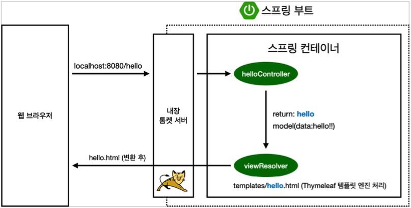

<!-- 2022.02.19 SAT -->

## Section 01. 프로젝트 환경설정

### 프로젝트 생성

#### 스프링 부트 스타터 사이트로 이동해서 스프링 프로젝트 생성

- https://start.spring.io
- 프로젝트 선택
  - Project: Gradle Project
  - Spring Boot: 2.6.3
  - Language: Java
  - Packaging: Jar
  - Java: 11
- Project Metadata
  - Group: hello
  - Artifact: hello-spring
- Dependencies: Spring Web, Thymeleaf

#### Gradle 전체 설정
- 동작 확인
  - 기본 메인 클래스 실행
  - 스프링 부트 메인 실행 후 에러페이지로 간단하게 동작 확인
    - http://localhost:8080

#### IntelliJ Gradle 대신에 자바 직접 실행

- 최근 IntelliJ 버전은 Gradle을 통해서 실행 하는 것이 기본 설정
  - 실행 속도가 느림
- Perferences -> Build, Execution, Deployment -> Build Tools -> Gradle
  - Build and run using: Gradle -> IntelliJ IDEA
  - Run tests using: Gradle -> IntelliJ IDEA

### 라이브러리 살펴보기

> Gradle은 의존관계가 있는 라이브러리를 함께 다운로드 함

#### 스프링 부트 라이브러리

- spring-boot-starter-web
  - spring-boot-starter-tomcat: 톰캣(웹서버)
  - spring-webmvc: 스프링 웹 MVC
- spring-boot-starter-thymeleaf: 타임리프 템플릿 엔진(View)
- spring-boot-starter(공통): 스프링 부트 + 스프링 코어 + 로깅
  - spring-boot
    - spring-core
  - spring-boot-starter-logging
    - logback, slf4j

#### 테스트 라이브러리

- spring-boot-starter-test
  - junit: 테스트 프레임워크
  - mockito: 목 라이브러리
  - assertj: 테스트 코드를 좀 더 편하게 작성하게 도와주는 라이브러리
  - spring-test: 스프링 통합 테스트 지원

### View 환경설정

#### Welcome Page 만들기

`resources/static/index.html`
```html
<!DOCTYPE HTML>
<html>
<head>
    <title>Hello</title>
    <meta http-equiv="Content-Type" content="text/html; charset=UTF-8" />
</head>
<body>
Hello
<a href="/hello">hello</a>
</body>
</html>
```
- 스프링 부트가 제공하는 Welcome Page 기능
  - `static/index.html`을 올려두면 Welcome page 기능을 제공

#### thymeleaf 템플릿 엔진

- thymeleaf 공식 사이트: https://www.thymeleaf.org/
- 스프링 공식 튜토리얼: https://spring.io/guides/gs/serving-web-content/
- 스프링 부트 메뉴얼(2.6.3): https://docs.spring.io/spring-boot/docs/current/reference/html/

`main/java/hello.hellospring.controller/HelloController.java`
```java
@Controller
public class HelloController {

    @GetMapping("hello")  // 주소 추적, localhost:8080/name 에서 name을 결정
    public String hello(Model model) {
        model.addAttribute("data", "hello!!");
        return "hello";  // 끌어올 html 파일 이름, 기본적으로 resources/templates에 있는 것을 찾아옴
        // localhost:8080/hello 를 하면 hello.html을 보여줌
    }
}
```

`resources/templates/hello.html`
```html
<!DOCTYPE HTML>
<html xmlns:th="http://www.thymeleaf.org">
<head>
    <title>Hello</title>
    <meta http-equiv="Content-Type" content="text/html; charset=UTF-8" />
</head>
<body>
<p th:text="'안녕하세요. ' + ${data}" >안녕하세요. 손님</p>
</body>
</html>
```

#### thymeleaf 템플릿 엔진 동작 확인

- 실행: http://localhost:8080/hello



- 컨트롤러에서 리턴 값으로 문자를 반환하면 `viewResolver`가 화면을 찾아서 처리
  - 스프링 부트 템플릿 엔진 기본 viewName 매핑
  - `resources:templates/` + {ViewName} + `.html`

> 참고: `spring-boot-devtools`라이브러리를 추가하면, `html`파일을 컴파일만 해주면 서버 재시작 없이 View 파일 변경이 가능
> <br>
> IntelliJ 컴파일 방법: build -> Recompile

### 빌드하고 실행하기

- 콘솔(cmd)로 이동
  1. `./gradlew build`
  2. `cd build/libs`
  3. `java -jar hello-spring-0.0.1-SNAPSHOT.jar`
  4. 실행 확인