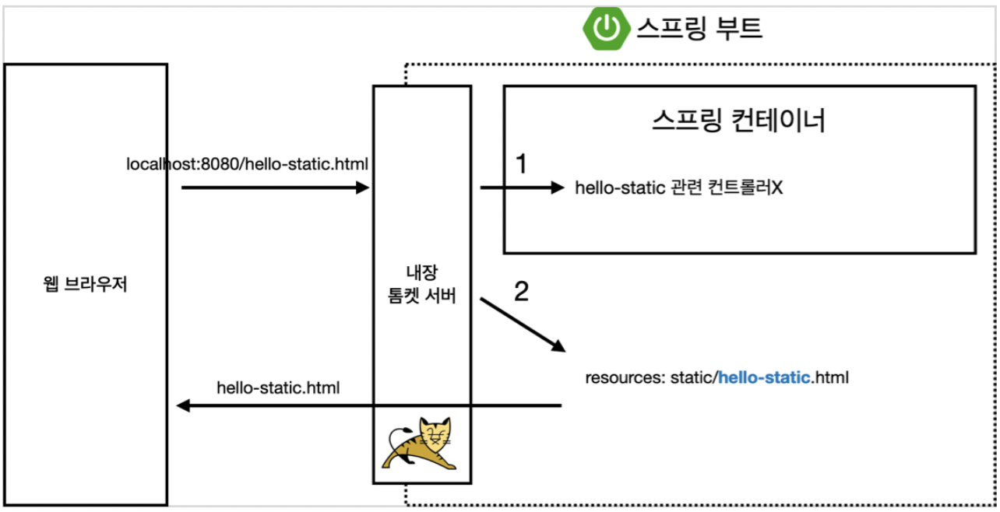
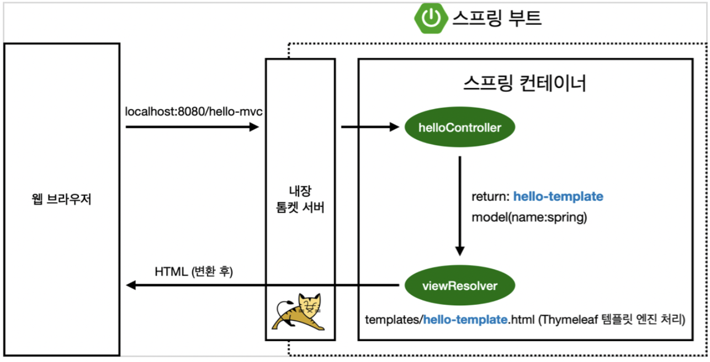
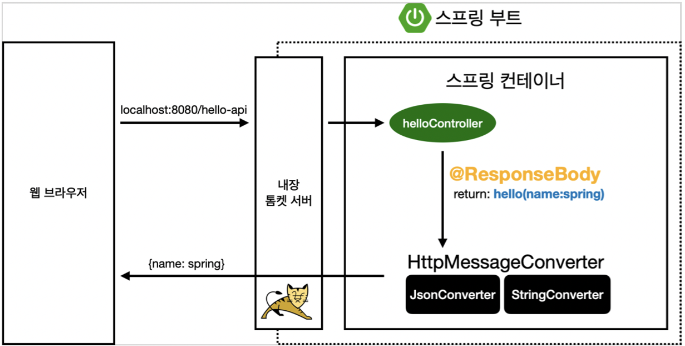

<!-- 2022.02.21 MON -->

## Section 02. 스프링 웹 개발 기초

### 정적 컨텐츠

- 스프링 부트 정적 컨텐츠 기능
`resources/static/hello-static.html`
```html
<!DOCTYPE HTML>
<html>
<head>
    <title>static content</title>
    <meta http-equiv="Content-Type" content="text/html; charset=UTF-8" />
</head>
<body>
정적 컨텐츠 입니다.
</body>
</html>
```

#### 실행

- http://localhost:8080/hello-static.html

#### 정적 컨텐츠 이미지



### MVC와 템플릿 엔진

- MVC: Model, View, Controller

#### Controller

`main/java/hello.hellospring.controller/HelloController.java`
```java
@Controller
public class HelloController {
    @GetMapping("hello-mvc")
    public String helloMvc(@RequestParam("name") String name, Model model) {  // 외부에서 가져오기
        // Parameter Info: command + P
        model.addAttribute("name", name);
        return "hello-template";
    }
}
```

#### View

`resources/template/hello-template.html`
```html
<html xmlns:th="http://www.thymeleaf.org">
<body>
<p th:text="'hello ' + ${name}">hello! empty</p>
</body>
</html>
```

#### 실행

- http://localhost:8080/hello-mvc?name=spring

#### MVC, 템플릿 엔진 이미지



### API

#### @ResponseBody 문자 반환

`main/java/hello.hellospring.controller/HelloController.java`
```java
@Controller
public class HelloController {
    @GetMapping("hello-string")
    @ResponseBody  // http의 boby
    public String helloString(@RequestParam("name") String name) {
        return "hello " + name;
    }
}
```
- `@ResponseBody`를 사용하면 `viewResolver`를 사용하지 않음
- 대신에 HTTP의 BODY에 문자 내용을 직접 반환(HTML BODY TAG를 말하는 것이 아님)

#### 실행

- http://localhost:8080/hello-string?name=spring

#### @ResponseBody 객체 반환

`main/java/hello.hellospring.controller/HelloController.java`
```java
@Controller
public class HelloController {
    @GetMapping("hello-api")
    @ResponseBody  // JSON
    public Hello helloApi(@RequestParam("name") String name) {
        // command + shift + enter
        Hello hello = new Hello();
        hello.setName(name);
        return hello;
    }

    static class Hello {
        private String name;

        // command + N
        public String getName() {
            return name;
        }

        public void setName(String name) {
            this.name = name;
        }
    }
}
```
- `@ResponseBody`를 사용하고, 객체를 반환하면 객체가 JSON으로 변환됨

#### 실행

- http://localhost:8080/hello-api?name=spring

#### @ResponseBody 사용 원리



- `@ResponseBody`를 사용
  - HTTP의 BODY에 문자 내용을 직접 반환
  - `viewResolver`대신에 `HttpMessageConverter`가 동작
  - 기본 문자처리: `StringHttpMessageConverter`
  - 기본 객체처리: `MappingJackson2HttpMessageConverter`
  - byte 처리 등등 기타 여러 HttpMessageConverter가 기본으로 등록되어 있음

> 참고: 클라이언트의 HTTP Accept 해더와 서버의 컨트롤러 반환 타입 정보 둘을 조합해서 `HttpMessageConverter`가 선택됨