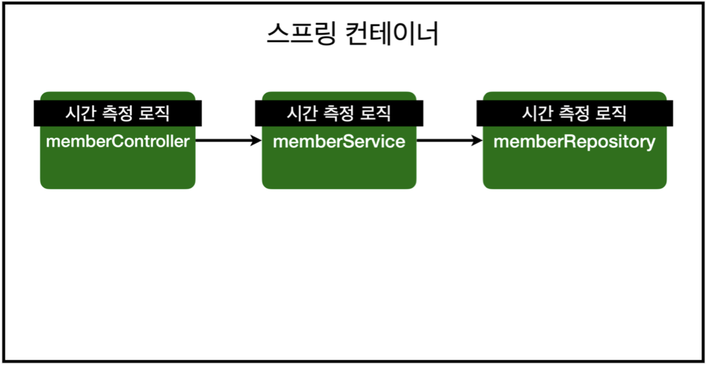
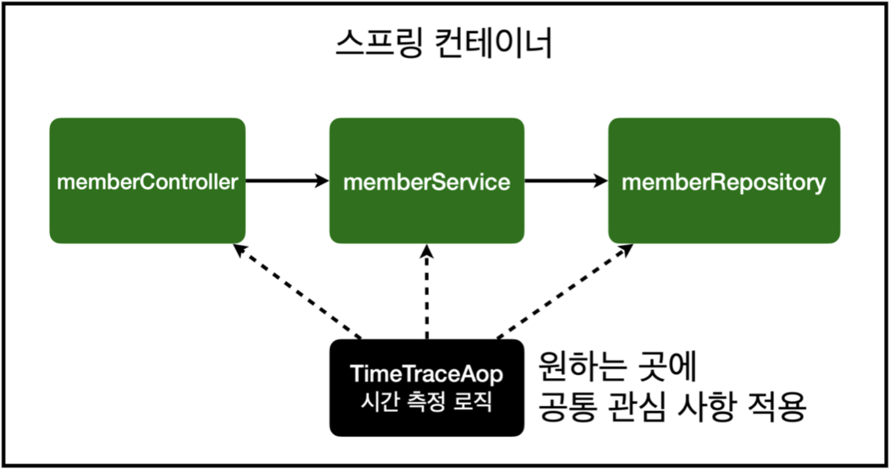
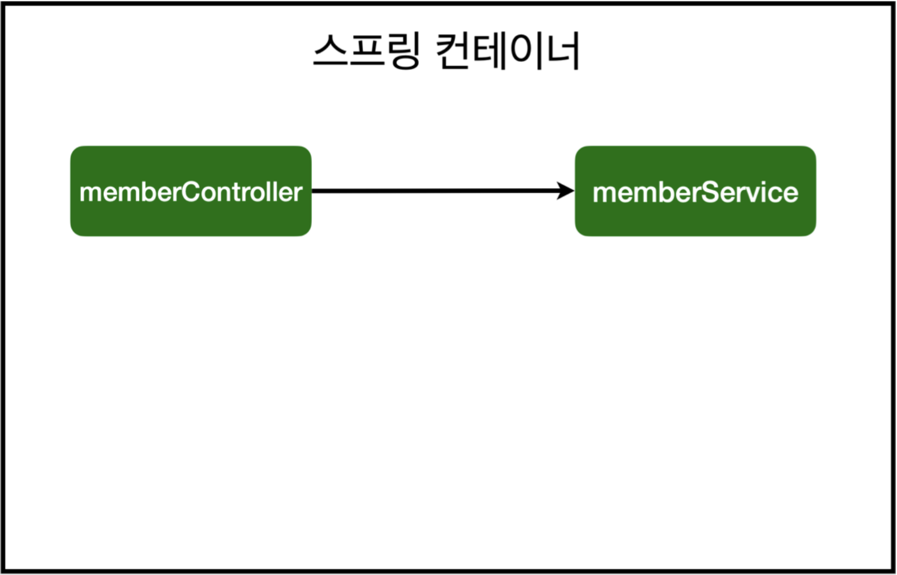
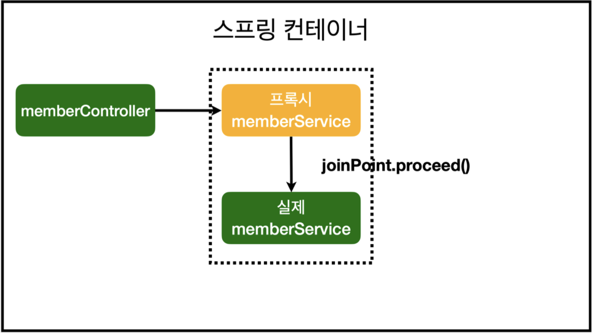
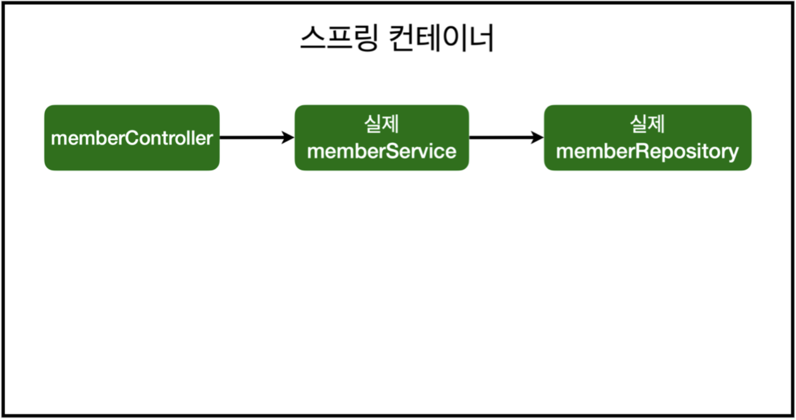
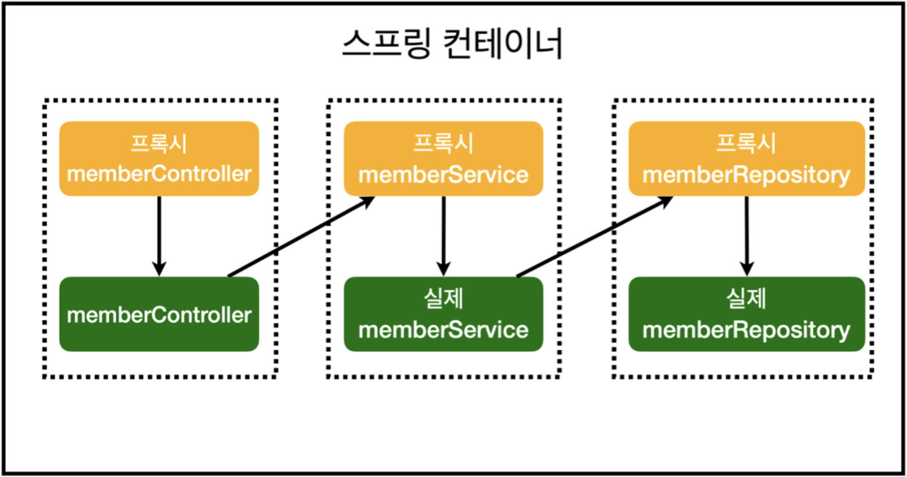

<!-- 2022.02.23 WED -->

## Section 07. AOP

### AOP가 필요한 상황

- 모든 메소드의 호출 시간을 측정하고 싶다면?
- 공통 관심 사항(cross-cutting concern) vs 핵심 관심 사항(core concern)
- 회원 가입 시간, 회원 조회 시간을 측정하고 싶다면?


#### MemberService 회원 조회 시간 측정 추가

<details>

```java
package hello.hellospring.service;

@Transactional
public class MemberService {
    public Long join(Member member) {
        long start = System.currentTimeMillis();
        try {
            validateDuplicateMember(member); //중복 회원 검증
            memberRepository.save(member);
            return member.getId();
        } finally {
            long finish = System.currentTimeMillis();
            long timeMs = finish - start;
            System.out.println("join " + timeMs + "ms");
        } 
    }

    public List<Member> findMembers() {
        long start = System.currentTimeMillis();
        try {
            return memberRepository.findAll();
        } finally {
            long finish = System.currentTimeMillis();
            long timeMs = finish - start;
            System.out.println("findMembers " + timeMs + "ms");
        } 
    }
}
```

</details>

#### 문제
- 회원가입, 회원 조회에 시간을 측정하는 기능은 핵심 관심 사항이 아님
- 시간을 측정하는 로직은 공통 관심 사항
- 시간을 측정하는 로직과 핵심 비즈니스의 로직이 섞여서 유지보수가 어려움
- 시간을 측정하는 로직을 별도의 공통 로직으로 만들기 매우 어려움
- 시간을 측정하는 로직을 변경할 때 모든 로직을 찾아가면서 변경해야 함

### AOP 적용

- AOP: Aspect Oriented Programming
- 공통 관심 사항(cross-cutting concern) vs 핵심 관심 사항(core concern) 분리


#### 시간 측정 AOP 등록

<details>

```java
package hello.hellospring.aop;

import org.aspectj.lang.ProceedingJoinPoint;
import org.aspectj.lang.annotation.Around;
import org.aspectj.lang.annotation.Aspect;
import org.springframework.stereotype.Component;

@Aspect
@Component
public class TimeTraceAop {

    @Around("execution(* hello.hellospring..*(..))")
    public Object execute(ProceedingJoinPoint joinPoint) throws Throwable {
        long start = System.currentTimeMillis();
        System.out.println("START: " + joinPoint.toString());
        try {
            return joinPoint.proceed();
        } finally {
            long finish = System.currentTimeMillis();
            long timeMs = finish - start;
            System.out.println("END: " + joinPoint.toString() + " " + timeMs + "ms");
        }
    }
}
```

</details>

#### 해결

- 회원가입, 회원 조회등 핵심 관심사항과 시간을 측정하는 공통 관심 사항을 분리
- 시간을 측정하는 로직을 별도의 공통 로직으로 만듬
- 핵심 관심 사항을 깔끔하게 유지할 수 있음
- 변경이 필요하면 이 로직만 변경하면 됨
- 원하는 적용 대상을 선택할 수 있음

### 스프링의 AOP 동작 방식 설명

#### AOP 적용 전 의존관계



#### AOP 적용 후 의존관계



#### AOP 적용 전 전체 그림



#### AOP 적용 후 전체 그림


