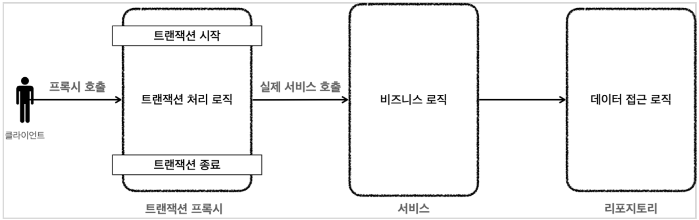
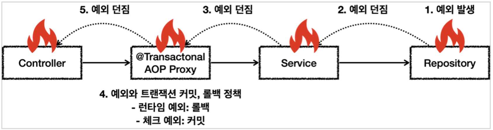

<!-- TOC -->
* [스프링 트랜잭션](#스프링-트랜잭션)
  * [스프링 트랜잭션 추상화](#스프링-트랜잭션-추상화)
    * [PlatformTransactionManager 인터페이스](#platformtransactionmanager-인터페이스)
  * [스프링 트랜잭션 사용 방식](#스프링-트랜잭션-사용-방식)
    * [선언적 트랜잭션 관리 (Declarative Transaction Management)](#선언적-트랜잭션-관리-declarative-transaction-management)
    * [프로그래밍 방식 트랜잭션 관리 (Programming Transaction Management)](#프로그래밍-방식-트랜잭션-관리-programming-transaction-management)
  * [선언적 트랜잭션과 AOP](#선언적-트랜잭션과-aop)
    * [프록시 도입 전](#프록시-도입-전)
    * [프록시 도입 후](#프록시-도입-후)
    * [프록시 도입 후 전체 과정](#프록시-도입-후-전체-과정)
  * [스프링이 제공하는 트랜잭션 AOP](#스프링이-제공하는-트랜잭션-aop)
* [트랜잭션 적용](#트랜잭션-적용)
  * [스프링 컨테이너에 트랜잭션 프록시 등록](#스프링-컨테이너에-트랜잭션-프록시-등록)
  * [트랜잭션 적용 위치](#트랜잭션-적용-위치)
* [트랜잭션 AOP 주의 사항](#트랜잭션-aop-주의-사항)
  * [프록시 내부 호출](#프록시-내부-호출)
    * [문제 원인](#문제-원인)
    * [프록시 방식의 AOP 한계](#프록시-방식의-aop-한계)
    * [문제 해결](#문제-해결)
    * [public 메서드만 트랜잭션 적용](#public-메서드만-트랜잭션-적용)
  * [초기화 시점](#초기화-시점)
* [트랜잭션 옵션](#트랜잭션-옵션)
  * [value, transactionManager](#value-transactionmanager)
  * [rollbackFor](#rollbackfor)
  * [noRollbackFor](#norollbackfor)
  * [propagation](#propagation)
  * [isolation](#isolation)
  * [timeout](#timeout)
  * [label](#label)
  * [readOnly](#readonly)
    * [프레임워크](#프레임워크)
    * [JDBC 드라이버](#jdbc-드라이버)
    * [데이터베이스](#데이터베이스)
* [예외와 트랜잭션 커밋, 롤백](#예외와-트랜잭션-커밋-롤백)
  * [예시 (주문 비즈니스 로직)](#예시-주문-비즈니스-로직)
<!-- TOC -->

# 스프링 트랜잭션

## 스프링 트랜잭션 추상화

* 각 데이터 접근 기술들은 트랜잭션을 처리하는 방식에 차이가 있다.
* 스프링은 이런 문제를 해결하기 위해 `PlatformTransactionManager`라는 인터페이스를 통해 트랜잭션 추상화를 제공한다.

### PlatformTransactionManager 인터페이스

```java
package org.springframework.transaction;

import org.springframework.lang.Nullable;

public interface PlatformTransactionManager extends TransactionManager {
    TransactionStatus getTransaction(@Nullable TransactionDefinition definition) throws TransactionException;

    void commit(TransactionStatus status) throws TransactionException;

    void rollback(TransactionStatus status) throws TransactionException;
}
```

## 스프링 트랜잭션 사용 방식

### 선언적 트랜잭션 관리 (Declarative Transaction Management)

* `@Transactional` 애노테이션 하나만 선언해서 매우 편리하게 트랜잭션을 적용하는 것이다.
* 선언적 트랜잭션 관리는 과거 XML에 설정하기도 했다.
* 프로그래밍 방식에 비해서 훨씬 간편하고 실용적이기 때문에 실무에서는 대부분 선언적 트랜잭션 관리를 사용한다.

### 프로그래밍 방식 트랜잭션 관리 (Programming Transaction Management)

* 트랜잭션 매니저 또는 트랜잭션 템플릿 등을 사용해서 트랜잭션 관련 코드를 직접 작성하는 것이다.
* 프로그래밍 방식 트랜잭션 관리를 사용하게 되면, 애플리케이션 코드가 트랜잭션이라는 기술 코드와 강하게 결합된다.

## 선언적 트랜잭션과 AOP

* `@Transactional`을 통한 선언적 트랜잭션 관리 방식을 사용하게 되면 기본적으로 프록시 방식의 AOP가 적용된다.

### 프록시 도입 전


* 서비스에 비즈니스 로직과 트랜잭션 처리 로직이 함께 섞여있다.

### 프록시 도입 후



* 트랜잭션 프록시가 트랜잭션 처리 로직을 모두 가져가고, 트랜잭션을 시작한 후에 실제 서비스를 대신 호출한다.
* 트랜잭션 프록시 덕분에 서비스 계층에는 순수한 비즈니스 로직만 남길 수 있다.

### 프록시 도입 후 전체 과정


* 트랜잭션은 커넥션에 `con.setAutocommit(false)`를 지정하면서 시작한다.
* 같은 트랜잭션을 유지하려면 같은 데이터베이스 커넥션을 사용해야 한다.
* 이것을 위해 스프링 내부에서는 트랜잭션 동기화 매니저가 사용된다.
* `JdbcTemplate`을 포함한 대부분의 데이터 접근 기술들은 트랜잭션을 유지하기 위해 내부에서 트랜잭션 동기화 매니저를 통해 리소스(커넥션)를 동기화 한다.

## 스프링이 제공하는 트랜잭션 AOP

* 스프링의 트랜잭션은 매우 중요한 기능이고, 전세계 누구나 다 사용하는 기능이다.
* 스프링은 트랜잭션 AOP를 처리하기 윈한 모든 기능을 제공한다.
* 스프링 부트를 사용하면 트랜잭션 AOP를 처리하기 위해 필요한 스프링 빈들도 자동으로 등록해준다.
* 개발자는 트랜잭션 처리가 필요한 곳에 `@Transactional` 애노테이션만 붙여주면 된다.
* 스프링 트랜잭션 AOP는 이 애노테이션을 인식해서 트랜잭션을 처리하는 프록시를 적용해준다.

# 트랜잭션 적용

## 스프링 컨테이너에 트랜잭션 프록시 등록


* `@Transaction` 애노테이션이 특정 클래스나 메서드에 하나라도 있으면 **트랜잭션 AOP는 프록시를 만들어서 스프링 컨테이너에 등록**한다.
  * 실제 `basicService` 객체 대신에 프록시인 `basicService$$CGLIB`를 스프링 빈으로 등록한다.
  * 프록시는 내부에 실제 `basicService`를 참조하게 된다.
* 클라이언트인 `txBasicTest`는 스프링 컨테이너에 `@Autowired BasicService basicService`로 의존 관계 주입을 요청한다.
  * 스프링 컨테이너에는 실제 객체 대신에 프록시가 스프링 빈으로 등록되어 있기 때문에 프록시를 주입한다.
* 프록시는 `BasicService`를 상속해서 만들어지기 때문에 다형성을 활용할 수 있다. 따라서 `BasicService` 대신에 프록시인 `BasicService$$CGLIB`를 주입할 수 있다.

## 트랜잭션 적용 위치

> 대원칙: 스프링에서 우선순위는 항상 **더 구체적이고 자세한 것이 높은 우선순위를 가진다.**

1. 클래스의 메서드 (우선순위 높음)
2. 클래스의 타입
3. 인터페이스의 메서드
4. 인터페이스의 타입 (우선순위 낮음)

* 인터페이스에 `@Transactional` 사용하는 것은 스프링 공식 메뉴얼에서 권항하지 않는 방법이다.
  * AOP를 적용하는 방식에 따라서 인터페이스에 애노테이션을 두면 AOP가 적용이 되지 않는 경우도 있다.

# 트랜잭션 AOP 주의 사항

## 프록시 내부 호출


* AOP를 적용하면 스프링은 대상 객체 대신에 프록시를 스프링 빈으로 등록하기 때문에, 스프링의 의존관계 주입시에 항상 실제 객체 대신에 프록시 객체를 주입한다.
* 프록시 객체가 주입되기 때문에 대상 객체를 직접 호출하는 문제는 일반적으로 발생하지 않는다.
* 하지만 **대상 객체의 내부에서 메서드 호출이 발생하면 프록시를 거치지 않고 대상 객체를 직접 호출하는 문제가 발생**한다.


1. 클라이언트인 테스트 코드는 `callService.external()`을 호출한다. 여기서 `callService`는 트랜잭션 프록시이다.
2. `callService`의 트랜잭션 프록시가 호출된다.
3. `external()` 메서드에는 `@Transactional`이 없다. 따라서 트랜잭션 프록시는 트랜잭션을 적용하지 않는다.
4. 트랜잭션 적용하지 않고, 실제 `callService` 객체 인스턴스의 `external()`을 호출한다.
5. `external()`은 내부에서 `internal()` 메서드를 호출한다. 여기서 문제가 발생한다.

### 문제 원인

* 자바 언어에서 메서드 앞에 별도의 참조가 없으면 `this`라는 뜻으로 자기 자신의 인스턴스를 가리킨다.
* 자기 자신의 내부 메서드를 호출하는 `this.internal()`이 되는데, 여기서 `this`는 자기 자신을 가리키므로, 실제 대상 객체(`target`)의 인스턴스를 뜻한다.
* 결과적으로 이러한 내부 호출은 프록시를 거치지 않는다. 따라서 트랜잭션을 적용할 수 없다.

### 프록시 방식의 AOP 한계

* `@Transactional`를 사용하는 트랜잭션 AOP는 프록시를 사용한다. 프록시를 사용하면 메서드 내부 호출에 프록시를 적용할 수 없다.

### 문제 해결

* 매서드 내부 호출 때문에 트랜잭션 프록시가 적용되지 않는 문제를 해결하기 위해 `internal()` 메서드를 별도의 클래스로 분리하여 해결한다.


1. 클라이언트 테스트 코드는 `callService.external()`을 호출한다.
2. `callService는` 실제 `callService` 객체 인스턴스이다.
3. `callService`는 주입 받은 `internalService.internal()`을 호출한다.
4. `internalService`는 트랜잭션 프록시이다. `internal()` 메서드에 `@Transactional`이 붙어있으므로 트랜잭션 프록시는 트랜잭션을 적용한다.
5. 트랜잭션 적용 후 실제 `internalService` 객체 인스턴스의 `internal()`을 호출한다.

* 여러가지 다른 해결방안도 있지만, 실무에서는 별도의 클래스로 분리하는 방법을 주로 사용한다.

### public 메서드만 트랜잭션 적용

* 스프링의 트랜잭션 AOP 기능은 `public` 메서드에만 트랜잭션을 적용하도록 기본 설정이 되어있다.
  * 클래스 레벨에 트랜잭션을 적용하면 모든 메서드에 트랜잭션이 걸릴 수 있다. 그러면 의도하지 않는 곳까지 트랜잭션이 과도하게 적용된다.
  * 트랜잭션은 주로 비즈니스 로직의 시작점에 걸기 때문에 대부분 외부에서 열어준 곳을 시작점으로 사용한다.
* `public`이 아닌곳에 `@Transactional`이 붙어 있으면 예외가 발생하지는 않고, **트랜잭션 적용만 무시**된다.

```text
스프링 부트 3.0 부터는 protected, package-visible(default 접근제한자)에도 트랜잭션이 적용된다.
```

## 초기화 시점

* 스프링 초기화 시점에는 트랜잭션 AOP가 적용되지 않을 수 있다.
  * 초기화 코드가 먼저 호출되고, 그 다음에 트랜잭션 AOP가 적용되기 때문에 초기화 시점에는 해당 메서드에서 트랜잭션을 획득할 수 없다.
* 가장 확실한 대안은 `ApplicationReadyEvent`를 사용하는 것이다.
  * `@EventListener(value = ApplicationReadyEvent.class)`
  * 트랜잭션 AOP를 포함한 스프링이 컨테이너가 완전히 생성되고 난 다음에 이벤트가 붙은 메서드를 호출해준다.

# 트랜잭션 옵션

```java
public @interface Transactional {
    String value() default "";

    String transactionManager() default "";

    Class<? extends Throwable>[] rollbackFor() default {};

    Class<? extends Throwable>[] noRollbackFor() default {};

    Propagation propagation() default Propagation.REQUIRED;

    Isolation isolation() default Isolation.DEFAULT;

    int timeout() default TransactionDefinition.TIMEOUT_DEFAULT;

    boolean readOnly() default false;

    String[] label() default {};
}
```

## value, transactionManager

* 트랜잭션을 사용하려면 먼저 스프링 빈에 등록된 어떤 트랜잭션 매니저를 사용할지 알아야 한다.
* `@Transactional`에서도 트랜잭션 프록시가 사용할 트랜잭션 매니저를 지정해주어야 한다.
  * `value`, `transactionManager` 둘 중 하나에 트랜잭션 매니저의 스프링 빈의 이름을 적어주면 된다.
* 값을 생략하면 기본으로 등록된 트랜잭션 매니저를 사용하기 때문에 대부분 생략한다.

## rollbackFor

* 기본 정책에서 추가로 어떤 예외가 발생할 때 롤백할 지 지정할 수 있다.
  * 언체크 예외인 `RuntimeException`, `Error`와 그 하위 예외가 발생하면 롤백한다.
  * 체크 예외인 `Exception`과 그 하위 예외들은 커밋한다.

## noRollbackFor

* rollbackFor와 반대로, 기본 정책에 추가로 어떤 예외가 발생했을 때 롤백하면 안되는지 지정할 수 있다.

## propagation

* 트랜잭션 전파에 대한 옵션이다.

## isolation

* 트랜잭션 격리 수준을 지정할 수 있다.
* 기본 값은 데이터베이스에서 설정한 트랜잭션 격리 수준을 사용하는 `DEFAULT`이다.
  * 대부분 데이터베이스에서 설정한 기준을 따른다.
* 애플리케이션 개발자가 트랜잭션 격리 수준을 직접 지정하는 경우는 드물다.
* DEFAULT: 데이터베이스에서 설정한 격리 수준을 따른다.
* READ_UNCOMMITED: 커밋되지 않은 읽기
* READ_COMMITED: 커밋된 읽기
* REPEATABLE_READ: 반복 가능한 읽기
* SERIALIZABLE: 직렬화 가능

## timeout

* 트랜잭션 수행 시간에 대한 타임아웃을 초 단위로 지정한다.
* 기본 값은 트랜잭션 시스템의 타임아웃을 사용한다.
* 운영 환경에 따라 동작하는 경우도 있고 그렇지 않은 경우도 있기 때문에 꼭 확인하고 사용해야 한다.

## label

* 트랜잭션 애노테이션에 있는 값을 직접 읽어서 어떤 동작을 하고 싶을 때 사용할 수 있다.
* 일반적으로 사용하지 않는다.

## readOnly

* 트랜잭션은 기본적으로 읽기 쓰기가 모두 가능한 트랜잭션이 생성된다.
* `readOnly=true` 옵션을 사용하면 읽기 전용 트랜잭션이 생성된다.
  * 등록, 수정, 삭제가 안되고 읽기 기능만 작동한다.
  * 읽기에서 다양한 성능 최적화가 발생할 수 있다.

### 프레임워크

* JdbcTemplate은 읽기 전용 트랜잭션 안에서 변경 기능을 실행하면 예외를 던진다.
* JPA(하이버네이트)는 읽기 전용 트랜잭션의 경우 커밋 시점에 플러시를 호출하지 않는다.
  * 추가로 변경이 필요 없으니 변경 감지를 위한 스냅샷 객체도 생성하지 않는다.

### JDBC 드라이버

* DB와 드라이버 버전에 따라서 다르게 동작하기 때문에 사전에 확인이 필요하다.
* 읽기 전용 트랜잭션에서 변경 쿼리가 발생하면 예외를 던진다.
* 읽기, 쓰기(마스터, 슬레이브) 데이터베이스를 구분해서 요청한다.

### 데이터베이스

* 데이터베이스에 따라 읽기 전용 트랜잭션인 경우 읽기만 하면 되므로, 내부에서 성능 최적화가 발생한다.

# 예외와 트랜잭션 커밋, 롤백



* 예외 발생시 스프링 트랜잭션 AOP는 예외의 종류에 따라 트랜잭션을 커밋하거나 롤백한다.
  * 언체크 예외인 `RuntimeException`, `Error`와 그 하위 예외가 발생하면 롤백한다.
  * 체크 예외인 `Exception`과 그 하위 예외들은 커밋한다.
  * 정상 응답(리턴)하면 트랜잭션을 커밋한다.
* 스프링은 기본적으로 체크 예외는 비즈니스 의미가 있을 때 사용하고, 런타임(언체크) 예외는 복구 불가능한 예외로 가정한다.
  * 체크 예외: 비즈니스 의미가 있을 때 사용
  * 언체크 예외: 복구 불가능한 예외

## 예시 (주문 비즈니스 로직)

1. **정상**: 주문시 결제를 성공하면 주문 데이터를 저장하고 결제 상태를 `완료`로 처리한다.
2. **시스템 예외**: 주문시 내부에 복구 불가능한 예외가 발생하면 전체 데이터를 롤백한다.
3. **비즈니스 예외**: 주문시 결제 잔고가 부족하면 주문 데이터를 저장하고, 결제 상태를 대기로 처리한다.

* 이 경우 고객에게 잔고 부족을 알리고 별도의 계좌로 입금하도록 안내한다.