<!-- TOC -->
* [스프링 트랜잭션 전파](#스프링-트랜잭션-전파)
  * [물리 트랜잭션, 논리 트랜잭션](#물리-트랜잭션-논리-트랜잭션)
    * [대원칙](#대원칙)
  * [전파](#전파)
    * [요청 흐름](#요청-흐름)
    * [응답 흐름](#응답-흐름)
    * [핵심 정리](#핵심-정리)
  * [외부 롤백](#외부-롤백)
    * [응답 흐름](#응답-흐름-1)
  * [내부 롤백](#내부-롤백)
    * [응답 흐름](#응답-흐름-2)
    * [정리](#정리)
  * [REQUIRES_NEW](#requires_new)
    * [요청 흐름](#요청-흐름-1)
    * [응답 흐름](#응답-흐름-3)
    * [정리](#정리-1)
* [다양한 전파 옵션](#다양한-전파-옵션)
  * [REQUIRED](#required)
  * [REQUIRES_NEW](#requires_new-1)
  * [SUPPORT](#support)
  * [NOT_SUPPORT](#not_support)
  * [MANDATORY](#mandatory)
  * [NEVER](#never)
  * [NESTED](#nested)
* [트랜잭션 전파와 옵션](#트랜잭션-전파와-옵션)
<!-- TOC -->

# 스프링 트랜잭션 전파

## 물리 트랜잭션, 논리 트랜잭션

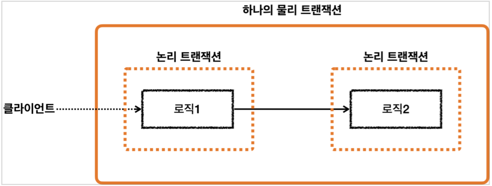

* 스프링은 논리 트랜잭션과 물리 트랜잭션이라는 개념을 나눈다.
* 물리 트랜잭션은 실제 데이터베이스에 적용되는 트랜잭션을 뜻한다.
  * 실제 커넥션을 통해서 트랜잭션을 시작하고, 실제 커넥션을 통해 커밋 및 롤백하는 단위이다.
* 논리 트랜잭션들은 하나의 물리 트랜잭션으로 묶인다.
* 논리 트랜잭션은 트랜잭션 매니저를 통해 트랜잭션을 사용하는 단위이다.
* 논리 트랜잭션 개념은 트랜잭션이 진행되는 중에 내부에 추가로 트랜잭션을 사용하는 경우에 나타난다. (더 정확히는 `REQUIRED` 전파 옵션을 사용하는 경우에 나타난다.)

### 대원칙

> 모든 논리 트랜잭션이 커밋되어야 물리 트랜잭션이 커밋된다.

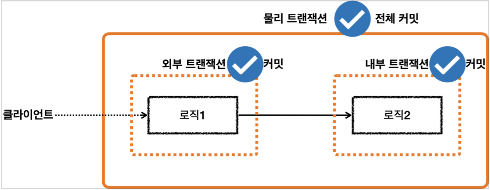

> 하나의 논리 트랜잭션이라도 롤백되면 물리 트랜잭션은 롤백된다.

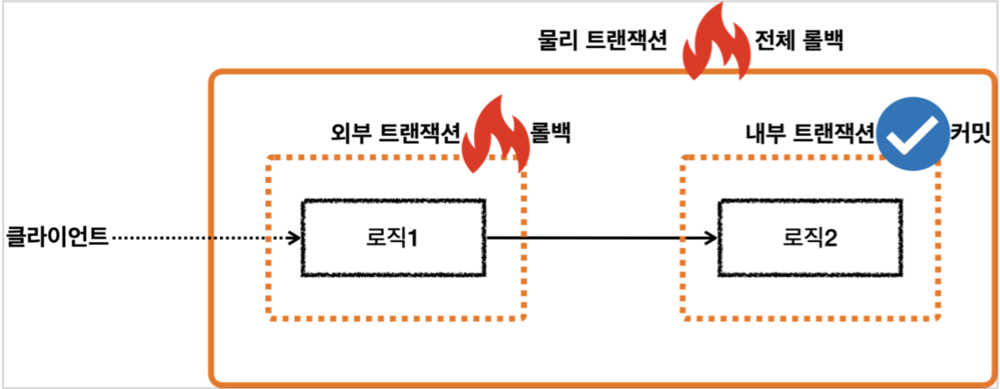
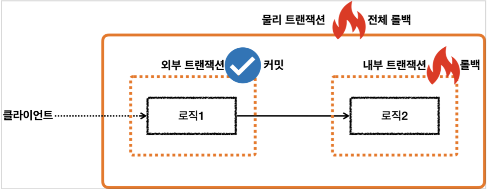

## 전파

### 요청 흐름

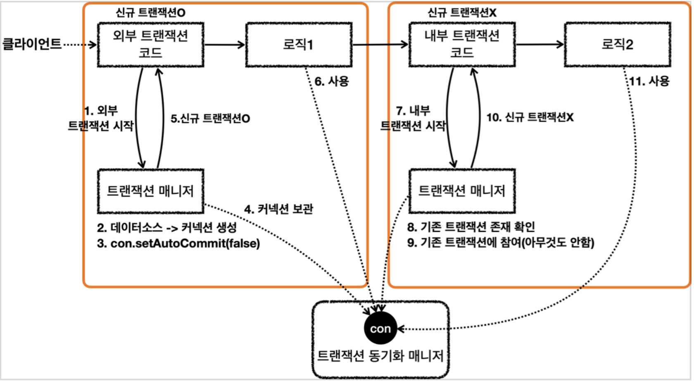

**외부 트랜잭션**

1. `txManager.getTransaction()`를 호출해서 외부 트랜잭션을 시작한다.
2. 트랜잭션 매니저는 데이터소스를 통해 커넥션을 생성한다.
3. 생성한 커넥션을 수동 커밋 모드(`setAutoCommit(false)`)로 설정한다. -> **물리 트랜잭션 시작**
4. 트랜잭션 매니저는 트랜잭션 동기화 매니저에 커넥션을 보관한다.
5. 트랜잭션 매니저는 트랜잭션을 생성한 결과를 `TransactionStatus`에 담아서 반환하는데, 여기에 신규 트랜잭션의 여부가 담겨 있다.
6. 로직1이 사용되고, 커넥션이 필요한 경우 트랜잭션 동기화 매니저를 통해 트랜잭션이 적용된 커넥션을 획득해서 사용한다.

**내부 트랜잭션**

7. `txManager.getTransaction()`를 호출해서 내부 트랜잭션을 시작한다.
8. 트랜잭션 매니저는 트랜잭션 동기화 매니저를 통해서 기존 트랜잭션이 존재하는지 확인한다.
9. 기본 트랜잭션이 존재하므로 기존 트랜잭션에 참여한다.

* 이미 기존 트랜잭션인 외부 트랜잭션에서 물리 트랜잭션을 시작했다. 그리고 물리 트랜잭션이 시작된 커넥션을 트랜잭션 동기화 매니저에 담아두었다.
* 이미 물리 트랜잭션이 진행중이므로 그냥 두면 이후 로직이 기존에 시작된 트랜잭션을 자연스럽게 사용하게 된다.
* 이후 로직은 자연스럽게 트랜잭션 동기화 매니저에 보관된 기존 커넥션을 사용하게 된다.

10. 트랜잭션 매니저는 트랜잭션을 생성한 결과를 `TransactionStatus`에 담아 반환한다.
11. 로직2가 사용되고, 커넥션이 필요한 경우 트랜잭션 동기화 매니저를 통해 외부 트랜잭션이 보관한 커넥션을 획득해서 사용한다.

### 응답 흐름

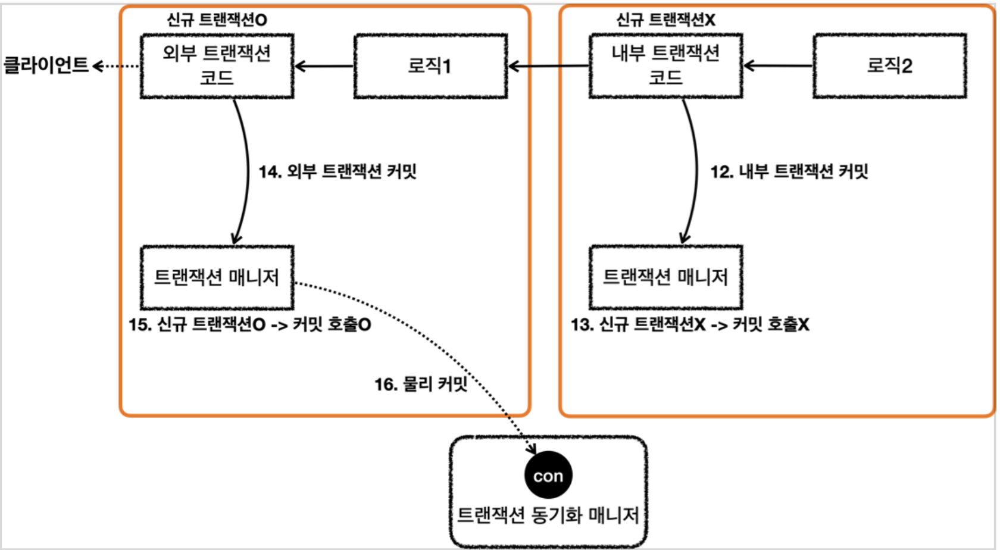

**내부 트랜잭션**

12. 로직2가 끝나고 트랜잭션 매니저를 통해 내부 트랜잭션을 커밋한다.
13. 현재 내부 트랜잭션은 신규 트랜잭션이 아니기 때문에 실제 커밋을 호출하지 않는다.

* 실제 커넥션에 커밋이나 롤백을 호출하면 물리 트랜잭션이 끝나버린다.
* 아직 트랜잭션이 끝난 것이 아니기 때문에 실제 커밋을 호출하면 안된다.

**외부 트랜잭션**

14. 로직1이 끝나고 트랜잭션 매니저를 통해 외부 트랜잭션을 커밋한다
15. 현재 외부 트랜잭션은 신규 트랜잭션이므로, DB 커넥션에 실제 커밋을 호출한다.
16. 실제 데이터베이스에 커밋이 반영되고, 물리 트랜잭션도 끝난다.

### 핵심 정리

* 트랜잭션 매니저에 커밋을 호출한다고해서 항상 실제 커넥션에 물리 커밋이 발생하지는 않는다.
* 신규 트랜잭션인 경우에만 실제 커넥션을 사용해서 물리 커밋과 롤백을 수행한다.
* 트랜잭션이 내부에서 추가로 사용되면 트랜잭션 매니저에 커밋하는 것이 항상 물리 커밋으로 이어지지 않는다.
* 트랜잭션 내부에서 추가로 사용되면, 트랜잭션 매니저를 통해 논리 트랜잭션을 관리하고, 모든 논리 트랜잭션이 커밋되면 물리 트랜잭션이 커밋된다고 이해하면 된다.

## 외부 롤백

### 응답 흐름

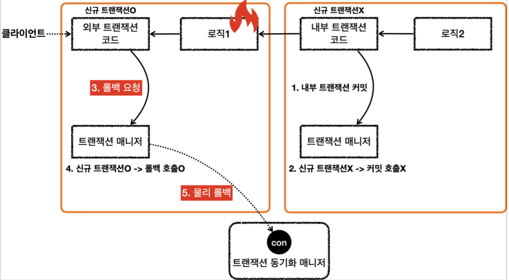

**내부 트랜잭션**

1. 로직2가 끝나고 트랜잭션 매니저를 통해 내부 트랜잭션을 커밋한다.
2. 현재 내부 트랜잭션은 신규 트랜잭션이 아니기 때문에 실제 커밋을 호출하지 않는다.

**외부 트랜잭션**

3. 로직1이 끝나고 트랜잭션 매니저를 통해 외부 트랜잭션을 롤백한다.
4. 현재 외부 트랜잭션은 신규 트랜잭션이므로, DB 커넥션에 실제 롤백을 호출한다.
5. 실제 데이터베이스에 롤백에 반영되고, 물리 트랜잭션도 끝난다.

## 내부 롤백

### 응답 흐름

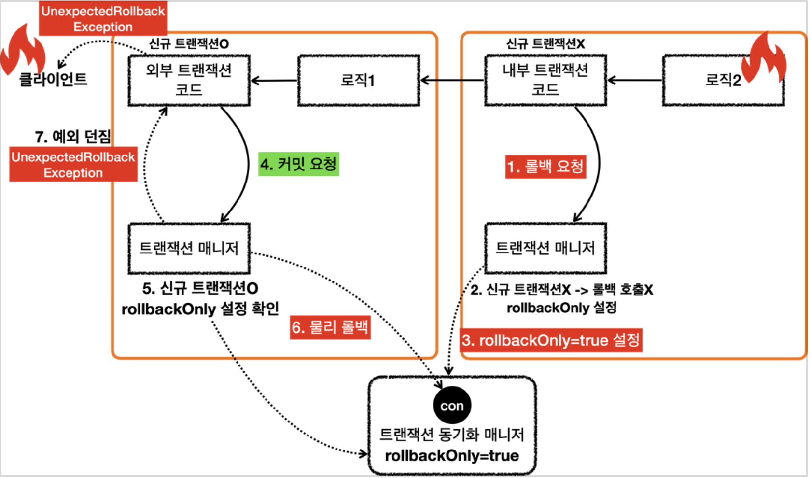

**내부 트랜잭션**

1. 로직2가 끝나고 트랜잭션 매니저를 통해 내부 트랜잭션을 롤백한다.
2. 현재 내부 트랜잭션은 신규 트랜잭션이 아니기 때문에 실제 롤백을 호출하지 않는다.
3. 내부 트랜잭션은 물리 트랜잭션을 롤백하지 않는 대신에 트랜잭션 동기화 매니저에 `rollbackOnly=true`라는 표시를 해둔다.

**외부 트랜잭션**

4. 로직1이 끝나고 트랜잭션 매니저를 통해 외부 트랜잭션을 커밋한다.
5. 현재 외부 트랜잭션은 신규 트랜잭션이므로, DB 커넥션에 실제 커밋을 호출해야 한다. 이때 먼저 트랜잭션 동기화 매니저에 롤백 전용(`rollbackOnly=true`) 표시가 있는지 확인한다. 롤백 전용
   표시가 있으면 물리 트랜잭션을 커밋하는 것이 아니라 롤백한다.
6. 실제 데이터베이스에 롤백에 반영되고, 물리 트랜잭션도 끝난다.
7. 트랜잭션 매니저에 커밋을 호출한 개발자 입장에서는 분명 커밋을 기대했지만 롤백 전용 표시로 인해 실제로는 롤백이 되었다.

* 스프링은 이 경우 `UnexpectedRollbackException` 런타임 예외를 던진다.

### 정리

* 논리 트랜잭션이 하나라도 롤백되면 물리 트랜잭션은 롤백된다.
* 내부 논리 트랜잭션이 롤백되면 롤백 전용 마크를 표시한다.
* 외부 트랜잭션을 커밋할 때 롤백 전용 마크를 확인한다. 롤백 전용 마크가 표시되어 있으면 물리 트랜잭션을 롤백하고, `UnexpectedRollbackException` 예외를 던진다.

## REQUIRES_NEW

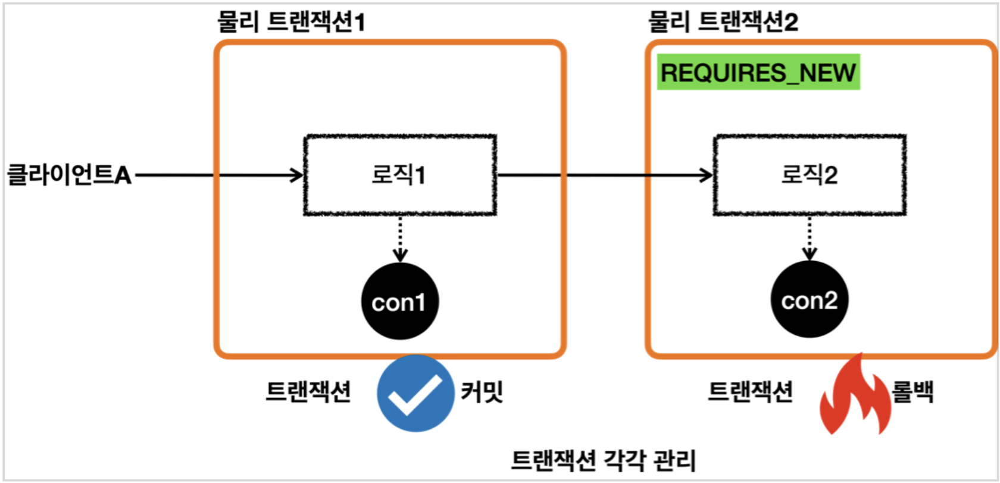

* 물리 트랜잭션을 분리하려면 내부 트랜잭션을 시작할 때 `REQUIRES_NEW` 옵션을 사용하면 된다.
* 외부 트랜잭션과 내부 트랜잭션이 각각 별도로 물리 트랜잭션을 가진다.
  * 별도의 물리 트랜잭션을 가진다는 뜻은 DB 커넥션을 따로 사용한다는 뜻이다.
* 내부 트랜잭션이 롤백되면서 로직2가 롤백되어도 로직1에서 저장한 데이터에는 영향을 주지않는다.
* 최종적으로 로직2는 롤백되고, 로직1은 커밋된다.

### 요청 흐름

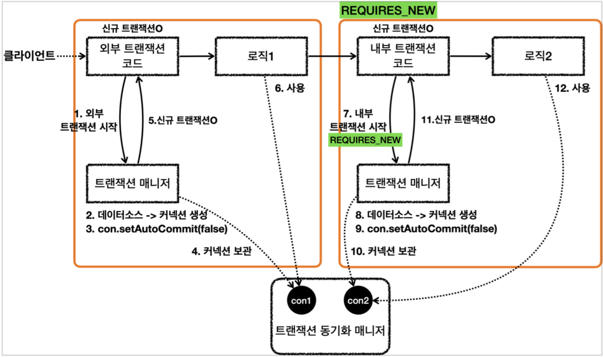

**외부 트랜잭션**

1. `txManager.getTransaction()`를 호출해서 외부 트랜잭션을 시작한다.
2. 트랜잭션 매니저는 데이터소스를 통해 커넥션을 생성한다.
3. 생성한 커넥션을 수동 커밋 모드(`setAutoCommit(false)`)로 설정한다. -> **물리 트랜잭션 시작**
4. 트랜잭션 매니저는 트랜잭션 동기화 매니저에 커넥션을 보관한다.
5. 트랜잭션 매니저는 트랜잭션을 생성한 결과를 `TransactionStatus`에 담아서 반환하는데, 여기에 신규 트랜잭션의 여부가 담겨 있다.
6. 로직1이 사용되고, 커넥션이 필요한 경우 트랜잭션 동기화 매니저를 통해 트랜잭션이 적용된 커넥션을 획득해서 사용한다.

**내부 트랜잭션**

7. **REQUIRES_NEW 옵션**과 함께 `txManager.getTransaction()`를 호출해서 내부 트랜잭션을 시작한다.
8. 트랜잭션 매니저는 데이터소스를 통해 커넥션을 생성한다.
9. 생성한 커넥션을 수동 커밋 모드(`setAutoCommit(false)`)로 설정한다. -> **물리 트랜잭션 시작**
10. 트랜잭션 매니저는 트랜잭션 동기화 매니저에 커넥션을 보관한다.

- 이때 `con1`은 잠시 보류되고, `con2`가 사용된다. (내부 트랜잭션을 완료할 때까지 `con2`가 사용된다.)

11. 트랜잭션 매니저는 신규 트랜잭션의 생성한 결과를 반환한다.
12. 로직2가 사용되고, 커넥션이 필요한 경우 트랜잭션 동기화 매니저에 있는 `con2` 커넥션을 획득해서 사용한다.

### 응답 흐름

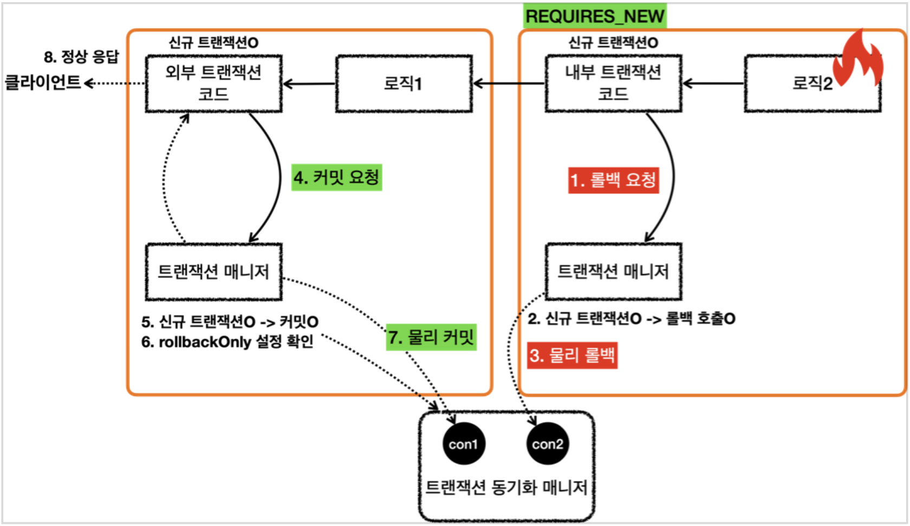

**내부 트랜잭션**

1. 로직2가 끝나고 트랜잭션 매니저를 통해 내부 트랜잭션을 롤백한다.
2. 현재 내부 트랜잭션은 신규 트랜잭션이므로 실제 롤백을 호출한다.
3. 내부 트랜잭션이 `con2` 물리 트랜잭션을 롤백한다. 트랜잭션이 종료되고, `con2`는 종료되거나 커넥션 풀에 반납된다. 이후에 `con1`의 보류가 끝나고, 다시 `con1`을 사용한다.

**외부 트랜잭션**

4. 외부 트랜잭션에 커밋을 요청한다.
5. 외부 트랜잭션은 신규 트랜잭션이기 때문에 물리 트랜잭션을 커밋한다.
6. 이때 `rollbackOnly` 설정을 체크한다. `rollbackOnly` 설정이 없으므로 커밋한다.
7. 외부 트랜잭션이 만든 `con1` 커넥션을 통해 물리 트랜잭션을 커밋한다. 트랜잭션이 종료되고, `con1`은 종료되거나 커넥션 풀에 반납된다.

### 정리

* `REQUIRES_NEW` 옵션을 사용하면 물리 트랜잭션이 명확하게 분리된다.
* `REQUIRES_NEW`를 사용하면 데이터베이스 커넥션이 동시에 2개 사용된다는 점을 주의해야 한다.
  * ex) 요청은 500개가 왔지만 커넥션은 1,000개를 사용한다.

# 다양한 전파 옵션

* 전파 옵션에 별도의 설정을 하지 않으면 `REQUIRED`가 기본으로 사용된다.
* 실무에서는 대부분 `REQUIRED` 옵션을 사용한다. 그리고 아주 가끔 `REQUIRES_NEW`을 사용하고, 나머지는 거의 사용하지 않는다.

## REQUIRED

> 가장 많이 사용하는 기본 설정으로, 기존 트랜잭션이 없으면 생성하고, 있으면 참여한다.

* 기존 트랜잭션 없음: 새로운 트랜잭션 생성
* 기존 트랜잭션 있음: 기존 트랜잭션에 참여

## REQUIRES_NEW

> 항상 새로운 트랜잭션을 생성한다.

* 기존 트랜잭션 없음: 새로운 트랜잭션 생성
* 기존 트랜잭션 있음: 새로운 트랜잭션 생성

## SUPPORT

> 트랜잭션을 지원한다는 뜻이다. 기존 트랜잭션이 없으면 없는대로 진행하고, 있으면 참여한다.

* 기존 트랜잭션 없음: 트랜잭션 없이 진행
* 기존 트랜잭션 있음: 기존 트랜잭션에 참여

## NOT_SUPPORT

> 트랜잭션을 지원하지 않는다는 의미이다.

* 기존 트랜잭션 없음: 트랜잭션 없이 진행
* 기존 트랜잭션 있음: 트랜잭션 없이 진행(기존 트랜잭션은 보류)

## MANDATORY

> 의무사항이다. 트랜잭션이 반드시 있어야 한다. 기존 트랜잭션이 없으면 예외가 발생한다.

* 기존 트랜잭션 없음: `IllegalTransactionStateException` 예외 발생
* 기존 트랜잭션 있음: 기존 트랜잭션에 참여

## NEVER

> 트랜잭션을 사용하지 않는다는 의미이다. 기존 트랜잭션이 있으면 예외가 발생한다. 기존 트랜잭션도 허용하지 않는 강한 부정의 의미로 이해하면 된다.

* 기존 트랜잭션 없음: 트랜잭션 없이 진행
* 기존 트랜잭션 있음: `IllegalTransactionStateException` 예외 발생

## NESTED

* 기존 트랜잭션 없음: 새로운 트랜잭션 생성
* 기존 트랜잭션 있음: 중첩 트랜잭션 생성
  * 중첩 트랜잭션은 외부 트랜잭션의 영향을 받지만, 중첨 트랜잭션은 외우베 영향을 주지 않는다.
  * 중첩 트랜잭션이 롤백 되어도 외부 트랜잭션은 커밋할 수 있다.
  * 외부 트랜잭션이 롤백되면 중첩 트랜잭션도 함께 롤백된다.
* 참고
  * JDBC savepoint 기능을 사용한다. DB 드라이버에서 해당 기능을 지원하는지 확인이 필요하다.
  * 중첩 트랜잭션은 JPA에서는 사용할 수 없다.

# 트랜잭션 전파와 옵션

* `isolation`, `timeout`, `readOnly`는 트랜잭션이 처음 시작될 때만 적용된다. 트랜잭션에 참여하는 경우에는 적용되지 않는다.