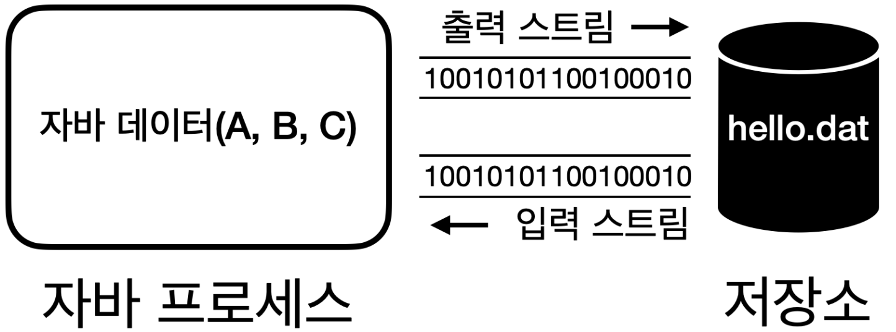

# IO (Input / Output)

<!-- TOC -->

* [Stream](#stream)
  * [부분으로 나누어 읽기 vs 전체 읽기](#부분으로-나누어-읽기-vs-전체-읽기)
* [InputStream / OutputStream](#inputstream--outputstream)
  * [InputStream](#inputstream)
  * [OutputStream](#outputstream)
  * [정리](#정리)
* [스트림 성능 테스트](#스트림-성능-테스트)
  * [성능 테스트 정보](#성능-테스트-정보)
  * [하나씩 쓰기 / 읽기](#하나씩-쓰기--읽기)
  * [버퍼 활용 쓰기 / 읽기](#버퍼-활용-쓰기--읽기)
    * [버퍼 크기에 따른 쓰기 성능](#버퍼-크기에-따른-쓰기-성능)
  * [Buffered 스트림 쓰기 / 읽기](#buffered-스트림-쓰기--읽기)
    * [기존 스트림 / 보조 스트림](#기존-스트림--보조-스트림)
    * [BufferedXxx 클래스의 특징](#bufferedxxx-클래스의-특징)
  * [한 번에 쓰기 / 읽기](#한-번에-쓰기--읽기)
* [정리](#정리-1)

<!-- TOC -->

# Stream



* **출력 스트림**: 자바 프로세스가 가지고 있는 데이터를 밖으로 보낼때 사용한다.
* **입력 스트림**: 외부 데이터를 자바 프로세스 안으로 가져올때 사용한다.
* 각 스트림은 **단방향**으로 흐른다.

## 부분으로 나누어 읽기 vs 전체 읽기

* `read(byte[], offset, length)`
  * 스트림의 내용을 부분적으로 읽거나, 읽은 내용을 처리하면서 스트림을 계속해서 읽어야 할 경우에 적합하다.
  * 메모리 사용량을 제어할 수 있다.
    * 100MB의 파일을 1MB 단위로 나누어 읽고 처리하는 방식을 사용하면 한 번에 최대 1MB의 메모리만 사용한다.
* `readAllBytes()`
  * 한 번의 호출로 모든 데이터를 읽을 수 있어서 편리하다.
  * 작은 파일이나 메모리에 모든 내용을 올려서 처리해야 하는 경우에 적합하다.
  * 메모리 사용량을 제어할 수 없다.
  * 큰 파일의 경우 OutOfMemoryError가 발생할 수 있다.

# InputStream / OutputStream

* 자바 내부에 있는 데이터를 외부에 있는 파일에 저장하거나, 네트워크를 통해 전송하거나 콘솔에 출력할 때 모두 byte 단위로 데이터를 주고 받는다.
* 자바는 `InputStream`, `OutputStream`이라는 기본 추상 클래스를 제공하여, 각각 데이터를 주고 받는 방식을 공통화시킨다.

## InputStream

```java
public abstract class InputStream implements Closeable {
    public abstract int read() throws IOException;

    public int read(byte[] b) throws IOException {
        return read(b, 0, b.length);
    }

    public byte[] readAllBytes() throws IOException {
        return readNBytes(Integer.MAX_VALUE);
    }
}

public class FileInputStream extends InputStream {
}

public class ByteArrayInputStream extends InputStream {
}

public class Socket implements java.io.Closeable {
    private static class SocketInputStream extends InputStream {
    }
}
```

## OutputStream

```java
public abstract class OutputStream implements Closeable, Flushable {
    public abstract void write(int b) throws IOException;

    public void write(byte[] b) throws IOException {
        write(b, 0, b.length);
    }
}

public class FileOutputStream extends OutputStream {
}

public class ByteArrayOutputStream extends OutputStream {
}

public class Socket implements java.io.Closeable {
    private static class SocketOutputStream extends OutputStream {
    }
}
```

## 정리

* **일관성**: 모든 종류의 입출력 작업에 대해 동일한 인터페이스(부모 메서드)를 사용할 수 있어, 코드의 일관성이 유지된다.
* **유연성**: 실제 데이터 소스나 목적지가 무엇인지에 관계없이 동일한 방식으로 코드를 작성할 수 있다.
* **확장성**: 새로운 유형의 입출력 스트림을 쉽게 추가할 수 있다.
* **재사용성**: 다양한 스트림 클래스들을 조합하여 복잡한 입출력 작업을 수행할 수 있다.
* **예외처리**: 표준화된 예외 처리 메커니즘을 통해 일관된 방식으로 오류를 처리할 수 있다.

> InputStream, OutputStream은 자바 1.0부터 제공되고, 일부 작동하는 코드도 들어있기 때문에 인터페이스가 아니라 추상 클래스로 제공된다.

# 스트림 성능 테스트

## 성능 테스트 정보

* 파일명: temp/buffered.dat
* 파일 크기: 10MB
* 버퍼 사이즈: 8KB

## 하나씩 쓰기 / 읽기

[하나씩 쓰기 성능 테스트 코드](files/codes/io/OutputStreamPerformanceTestV1.md)

```
File created: temp/buffered.dat
File size: 10MB
Time taken: 14063ms
```

[하나씩 읽기 성능 테스트 코드](files/codes/io/InputStreamPerformanceTestV1.md)

```
File created: temp/buffered.dat
File size: 10MB
Time taken: 4700ms
```

## 버퍼 활용 쓰기 / 읽기

[버퍼 활용 쓰기 성능 테스트 코드](files/codes/io/OutputStreamPerformanceTestV2.md)

```
File created: temp/buffered.dat
File size: 10MB
Time taken: 14ms
```

[버퍼 활용 읽기 성능 테스트 코드](files/codes/io/InputStreamPerformanceTestV2.md)

```
File created: temp/buffered.dat
File size: 10MB
Time taken: 3ms
```

### 버퍼 크기에 따른 쓰기 성능

* 많은 데이터를 한 번에 전달하면 성능을 최적화 할 수 있다. 이렇게 되면 시스템 콜도 줄어들고, HDD, SDD 같은 장치들의 작동 횟수도 줄어든다.
* 하지만 디스크나 파일 시스템에서 데이터를 읽고 쓰는 기본 단위가 보통 4KB, 8KB이기 때문에 버퍼의 크기가 커진다고 해서 속도가 줄어들지는 않는다.
* 따라서 버퍼의 크기는 보통 4KB, 8KB 정도로 잡는 것이 효율적이다.

## Buffered 스트림 쓰기 / 읽기

[Buffered 스트림 쓰기 성능 테스트 코드](files/codes/io/OutputStreamPerformanceTestV3.md)

```
File created: temp/buffered.dat
File size: 10MB
Time taken: 112ms
```

[Buffered 스트림 읽기 성능 테스트 코드](files/codes/io/InputStreamPerformanceTestV3.md)

```
File created: temp/buffered.dat
File size: 10MB
Time taken: 102ms
```

### 기존 스트림 / 보조 스트림

* `FileOutputStream`과 같이 단독으로 사용할 수 있는 스트림을 기본 스트림이라 한다.
* `BufferedOutputStream`과 같이 단독으로 사용할 수 없고, 보조 기능을 제공하는 스트림을 보조 스트림이라 한다.

### BufferedXxx 클래스의 특징

* 자바 초창기에 만들어진 클래스로, 처음부터 멀티 스레드를 고려해서 만든 클래스이다.
  * 멀티 스레드에서 안전하지만 락을 걸고 푸는 동기화 코드로 인해 성능이 약간 저하될 수 있다.
* 싱글 스레드 상황에서는 동기화 락이 필요하지 않기 때문에 직접 버퍼를 다를 때와 비교해서 성능이 떨어진다.
* 일반적인 상황이라면 이 정도 성능은 문제가 되지 않기 때문에 싱글 스레드여도 `BufferedXxx`를 사용하면 충분하다.

## 한 번에 쓰기 / 읽기

* 파일의 크기가 크지 않다면 간단하게 한 번에 쓰고 읽는 것도 좋은 방법이다.
* 성능은 가장 빠르지만, 결과적으로 메모리를 한 번에 많이 사용하기 때문에 파일의 크기가 작아야 한다.

[한 번에 쓰기 성능 테스트 코드](files/codes/io/OutputStreamPerformanceTestV4.md)

```
File created: temp/buffered.dat
File size: 10MB
Time taken: 11ms
```

[한 번에 읽기 성능 테스트 코드](files/codes/io/InputStreamPerformanceTestV4.md)

```
File created: temp/buffered.dat
File size: 10MB
Time taken: 3ms
```

# 정리

* 파일의 크기가 크지 않아서, 메모리 사용에 큰 영향을 주지 않는다면 쉽고 빠르게 한 번에 처리하자.
* 성능이 중요하고 큰 파일을 나누어 처리해야 한다면, 버퍼를 직접 다루자.
* 성능이 크게 중요하지 않고, 버퍼 기능이 필요하면 `BufferedXxx`를 사용하자.
  * `BufferedXxx`는 동기화 코드가 들어있어서 스레드 안전하지만, 약간의 성능 저하가 있다.
