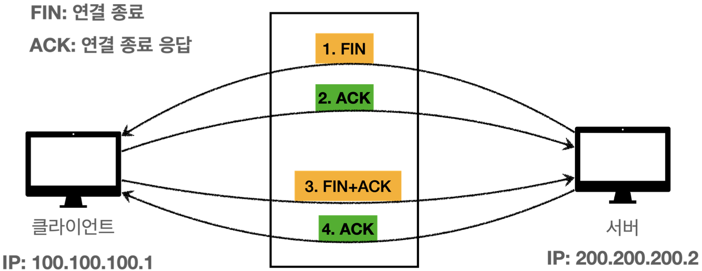
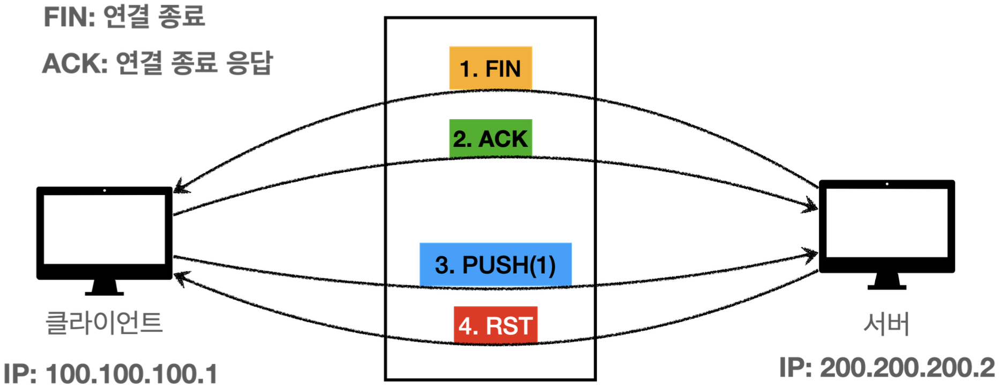

# 네트워크 예외

<!-- TOC -->

* [연결 예외](#연결-예외)
  * [java.net.UnknownHostException](#javanetunknownhostexception)
    * [코드](#코드)
    * [실행 결과](#실행-결과)
  * [java.net.ConnectException: Connection refused](#javanetconnectexception-connection-refused)
    * [코드](#코드-1)
    * [실행 결과](#실행-결과-1)
* [타임아웃](#타임아웃)
  * [연결 타임아웃](#연결-타임아웃)
    * [OS 기본 대기 시간](#os-기본-대기-시간)
    * [코드](#코드-2)
    * [실행 결과](#실행-결과-2)
  * [연결 타임아웃 - 직접 설정](#연결-타임아웃---직접-설정)
    * [코드](#코드-3)
    * [실행 결과](#실행-결과-3)
  * [TCP 소켓 타임아웃 - read 타임아웃](#tcp-소켓-타임아웃---read-타임아웃)
    * [코드](#코드-4)
    * [실행 결과](#실행-결과-4)
    * [실무 관점](#실무-관점)
* [연결 종료](#연결-종료)
  * [정상 종료](#정상-종료)
    * [4-way handshake](#4-way-handshake)
  * [강제 종료](#강제-종료)
    * [RST(Reset) 패킷](#rstreset-패킷)
  * [정리](#정리)
* [네트워크 종료와 예외 정리](#네트워크-종료와-예외-정리)

<!-- TOC -->

# 연결 예외

> 네트워크 연결시 발생할 수 있는 예외

## java.net.UnknownHostException

* 호스트를 알 수 없을때 발생하는 예외이다.

### 코드

```java
import java.io.IOException;
import java.net.*;

public class ConnectMain {

    public static void main(String[] args) throws IOException {
        unknownHostEx1();
        unknownHostEx2();
    }

    public static void unknownHostEx1() throws IOException {
        try {
            Socket socket = new Socket("999.999.999.999", 80);
        } catch (UnknownHostException e) {
            e.printStackTrace();
        }
    }

    private static void unknownHostEx2() throws IOException {
        try {
            Socket socket = new Socket("google.gogo", 80);
        } catch (UnknownHostException e) {
            e.printStackTrace();
        }
    }
}
```

### 실행 결과

```text
java.net.UnknownHostException: 999.999.999.999
	...
java.net.UnknownHostException: google.gogo
  ...
```

## java.net.ConnectException: Connection refused

* 연결이 거절되었을 때 발생하는 예외이다.
* IP에 해당하는 서버는 켜져있지만, 사용하는 PORT가 없을 때 주로 발생한다.
  * IP의 서버 컴퓨터에 접속은 성공했지만, 포트를 사용하지 않기 때문에 거절한다.
* 네트워크 방화벽 등에서 무단 연결로 인지하고 연결을 막을 때도 발생한다.
* 서버 컴퓨터의 OS는 TCP RST(Reset)라는 패킷을 보내서 연결을 거절한다.
  * **TCP RST(Reset) 패킷**: TCP 연결에 문제가 있다는 뜻이다. 해당 패킷을 받으면 받은 대상은 즉시 연결을 해제해야 한다.
* 클라이언트가 연결 시도 중에 RST 패킷을 받으면 해당 예외가 발생한다.

### 코드

```java
import java.io.IOException;
import java.net.*;

public class ConnectMain {

    public static void main(String[] args) throws IOException {
        connectionRefused();
    }

    private static void connectionRefused() throws IOException {
        try {
            Socket socket = new Socket("localhost", 45678);
        } catch (ConnectException e) {
            e.printStackTrace();
        }
    }
}
```

### 실행 결과

```text
java.net.ConnectException: Connection refused
  ...
```

# 타임아웃

## 연결 타임아웃

> 네트워크 연결을 시도했지만 응답이 없어 연결 대기 시간을 초과하는 경우 발생

* TCP 연결을 클라이언트가 오래 대기하는 것은 좋은 방법이 아니다.
  * 고객에게 빠르게 현재 연결에 문제가 있다고 알려주는 것이 더 나은 방법이다.

### OS 기본 대기 시간

* TCP 연결을 시도했는데 연결 응답이 없다면 OS에는 연결 대기 타임아웃이 설정되어 있다.
  * Windows: 약 21초
  * Linux: 약 75초에서 180초 사이
  * Max: 약 75초
* 해당 시간이 지나면 `java.net.ConnectException: Operation timed out` 예외가 발생한다.

### 코드

```java
import java.io.IOException;
import java.net.*;

public class ConnectTimeoutMain1 {

    public static void main(String[] args) throws IOException {
        long start = System.currentTimeMillis();

        try {
            Socket socket = new Socket("192.168.1.250", 45678);
        } catch (ConnectException e) {
            e.printStackTrace();
        }

        long end = System.currentTimeMillis();
        System.out.println("end = " + (end - start));
    }
}
```

### 실행 결과

```text
java.net.ConnectException: Operation timed out
  ...
end = 75022
```

## 연결 타임아웃 - 직접 설정

* TCP 연결 타임아웃 시간을 직접 설정할 수 있다.

### 코드

```java
import java.io.IOException;
import java.net.*;

public class ConnectTimeoutMain2 {

    public static void main(String[] args) throws IOException {
        long start = System.currentTimeMillis();

        try {
            Socket socket = new Socket();
            socket.connect(new InetSocketAddress("192.168.1.250", 45678), 1000);
        } catch (SocketTimeoutException e) {
            e.printStackTrace();
        }

        long end = System.currentTimeMillis();
        System.out.println("end = " + (end - start));
    }
}
```

* Socket 객체를 생성할 때 인자로 IP, PORT를 모두 전달하면 생성자에서 바로 TCP 연결을 시도한다.
* 반대로 IP, PORT를 모두 빼고 객체를 생성하면, 객체만 생성되고 연결은 시도하지 않는다.
* 이후 `connect()` 메서드를 호출하면 TCP 연결을 시도한다.

```java
public void connect(SocketAddress endpoint, int timeout) throws IOException {
}
```

* InetSocketAddress: SocketAddress의 자식이다. IP, PORT 기반의 주소를 객체로 제공한다.
* timeout: 밀리초 단위로 연결 타임아웃을 지정할 수 있다.

### 실행 결과

```text
java.net.SocketTimeoutException: Connect timed out
	...
end = 1017
```

## TCP 소켓 타임아웃 - read 타임아웃

> TCP 연결이 잘 된 이후에 클라이언트가 서버에 요청을 했지만, 서버가 계속 응답을 주지 않을때 발생

### 코드

```java
import java.io.IOException;
import java.net.*;

public class SoTimeoutServer {
    public static void main(String[] args) throws IOException, InterruptedException {
        ServerSocket serverSocket = new ServerSocket(12345);
        Socket socket = serverSocket.accept();

        Thread.sleep(1000000);
    }
}
```

```java
import java.io.*;
import java.net.Socket;

public class SoTimeoutClient {
    public static void main(String[] args) throws IOException {
        Socket socket = new Socket("localhost", 12345);
        InputStream input = socket.getInputStream();

        try {
            socket.setSoTimeout(3000); //타임아웃 시간 설정
            int read = input.read(); //기본은 무한 대기
            System.out.println("read = " + read);
        } catch (Exception e) {
            e.printStackTrace();
        }
    }
}
```

### 실행 결과

```text
java.net.SocketTimeoutException: Read timed out
  ...
```

### 실무 관점

* 실무에서 자주 발생하는 장애 원인 중 하나가 바로 연결 타임아웃, 소켓 타임아웃(read 타임아웃)을 누락하기 때문에 발생한다.
* **외부 서버와 통신을 하는 경우 반드시 연결 타임아웃과 소켓 타임아웃을 지정하자.**

# 연결 종료

## 정상 종료

### 4-way handshake



1. 서버는 연결 종료를 위해 클라이언트에 FIN 패킷을 전달한다.
2. 클라이언트가 FIN 패킷을 받으면, 클라이언트의 OS에서 FIN 패킷에 대한 ACK 패킷을 전달한다.
3. 클라이언트도 연결 종료를 위해 서버에 FIN 패킷을 전달한다.
4. 서버가 FIN 패킷을 받으면, 서버의 OS에서 FIN 패킷에 대한 ACK 패킷을 전달한다.

## 강제 종료

### RST(Reset) 패킷

* TCP 연결 중에 문제가 발생하면 RST 패킷이 전송된다.
* TCP에서 RST 패킷은 연결 상태를 초기화(리셋)해서 더 이상 현재의 연결을 유지하지 않겠다는 의미를 전달한다.
* RST 패킷은 TCP 연결에 문제가 있는 다양한 상황에서 발생한다.
  * TCP 스펙에 맞지 않는 순서로 메시지가 전달될 때
  * TCP 버퍼에 있는 데이터를 아직 다 읽지 않았는데, 연결을 종료할 때
  * 방화벽 같은 곳에서 연결을 강제로 종료할 때



1. 서버는 연결 종료를 위해 클라이언트에 FIN 패킷을 전달한다.
2. 클라이언트가 FIN 패킷을 받으면, 클라이언트의 OS에서 FIN 패킷에 대한 ACK 패킷을 전달한다.
3. 클라이언트가 서버에 메시지를 전달하기 위해 서버에 데이터를 전송하는 PUSH 패킷을 전달한다.
4. 서버는 이미 FIN 패킷으로 종료를 요청하여 FIN 패킷을 기대했지만, PUSH 패킷으로 데이터가 전송되었다.
5. 서버는 TCP 연결에 문제가 있다고 판단하여 즉시 연결을 종료하라는 RST 패킷을 클라이언트에 전송한다.

## 정리

* 상대방이 연결을 종료한 경우 데이터를 읽으면 EOF가 발생한다.
  * -1, `null`, `EOFException` 등이 발생한다.
  * 이 경우 연결을 끊어야 한다.
* `java.net.SocketException: Connection reset`
  * RST 패킷을 받은 이후 `read()` 호출시 발생한다.
* `java.net.SocketException: Broken pipe`
  * RST 패킷을 받은 이후에 `write()` 호출시 발생한다.
* `java.net.SocketException: Socket is closed`
  * 자신이 소켓을 닫은 이후에 `read()`, `write()` 호출시 발생한다.

# 네트워크 종료와 예외 정리

* 네트워크에서 발생할 수 있는 예외들은 다양하다. 따라서 어떤 문제가 언제 발생할지 자세하게 다 구분해서 처리하기는 어렵다.
* 따라서 기본적으로 정상 종료, 강제 종료 모두 자원 정리하고 닫도록 설계하면 된다.
* `SocketException`, `EOFException` 모두 `IOException`의 자식이다. 따라서 `IOException`이 방생하면 자원을 정리히면 된다.
* 만약 더 자세히 분류해야 하는 경우가 발생하면 그때 예외를 구분해서 처리하면 된다.