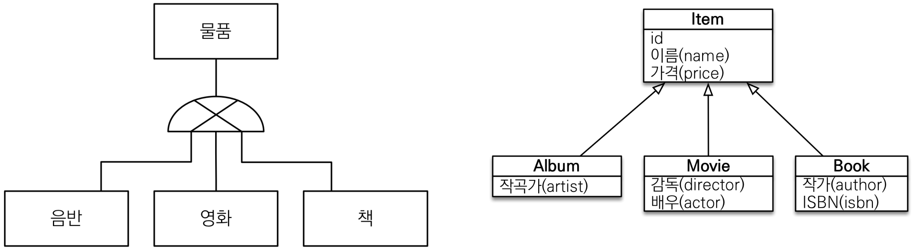
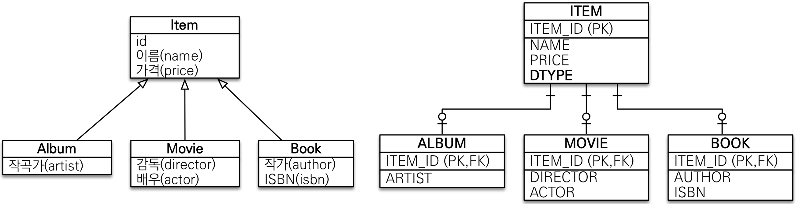
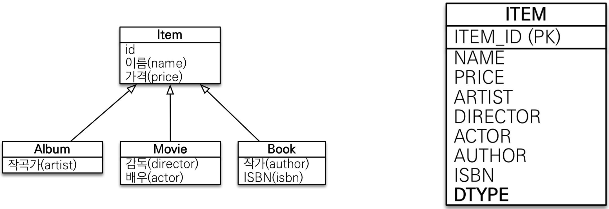
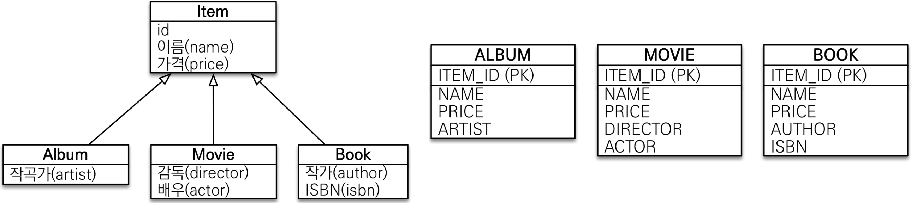
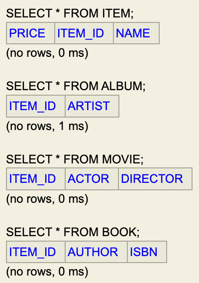
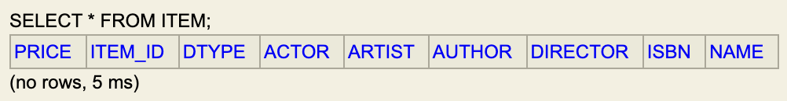

# JPA 상속관계 매핑 전략

<!-- TOC -->

* [상속관계 매핑](#상속관계-매핑)
  * [슈퍼-서브타입 논리 모델을 실제 물리 모델로 구현하는 방법](#슈퍼-서브타입-논리-모델을-실제-물리-모델로-구현하는-방법)
* [조인 전략 (Join Strategy)](#조인-전략-join-strategy)
  * [장점](#장점)
  * [단점](#단점)
* [단일 테이블 전략 (Single-Table Strategy)](#단일-테이블-전략-single-table-strategy)
  * [장점](#장점-1)
  * [단점](#단점-1)
* [구현 클래스마다 테이블 전략 (Table-Per-Class Strategy)](#구현-클래스마다-테이블-전략-table-per-class-strategy)
  * [장점](#장점-2)
  * [단점](#단점-2)
* [주요 어노테이션](#주요-어노테이션)
  * [DTYPE](#dtype)
  * [부모 클래스는 추상 클래스로 선언](#부모-클래스는-추상-클래스로-선언)
* [Practice](#practice)
  * [공통 코드](#공통-코드)
  * [조인 전략](#조인-전략)
  * [단일 테이블 전략](#단일-테이블-전략)

<!-- TOC -->

## 상속관계 매핑



> 객체의 상속 구조와 관계형 데이터베이스의 슈퍼-서브타입 관계를 매핑

* 관계형 데이터베이스에는 상속 관계가 존재하지 않는다.
* 관계형 데이터베이스의 슈퍼-서브타입 관계라는 모델링 기법이 객체 상속과 유사하다.

### 슈퍼-서브타입 논리 모델을 실제 물리 모델로 구현하는 방법

* 각 테이블로 변환 -> 조인 전략
* 통합 테이블로 변환 -> 단일 테이블 전략
* 서브타입 테이블로 변환 -> 구현 테이블마다 테이블 전략

## 조인 전략 (Join Strategy)



### 장점

* 테이블 정규화
* 외래키 참조 무결성 제약조건 활용가능
* 저장공간 효율화

### 단점

* 조회시 잦은 조인으로 성능 저하
  * Album 조회시 Item과 Album을 조인해서 조회
* 복잡한 조회 쿼리
* 데이터 저장시 INSERT SQL 2번 호출
  * Album 저장시 Item, Album 테이블에 각각 INSERT

## 단일 테이블 전략 (Single-Table Strategy)



### 장점

* 조인이 발생하지 않아 일반적으로 조회 성능이 빠름
* 단순한 조회 쿼리

### 단점

* 자식 엔티티가 매핑한 컬럼은 모두 null 허용
  * Album 저장시 Movie, Book 컬럼은 모두 null
* 단일 테이블에 모든 것을 저장하므로 테이블이 커질 수 있음 -> 상황에 따라서 조회 성능이 오히려 느려질 수 있음

## 구현 클래스마다 테이블 전략 (Table-Per-Class Strategy)


> 데이터베이스 설계자와 ORM 전문가 둘 다 추천하지 않는 전략

### 장점

* 서브 타입을 명확하게 구분해서 처리할 때 효과적
* not null 제약조건 사용 가능

### 단점

* 여러 자식 테이블을 함께 조회할 때 성능이 느림(UNION SQL 필요)
  * 10,000이하의 Item 조회시 Album, Movie, Book을 모두 UNION하여 조회
* 자식 테이블을 통합해서 쿼리하기 어려움

## 주요 어노테이션

* `@Inheritance(strategy = InheritanceType.XXX)`: 상속관계 매핑 전략 결정
  * JOINED: 조인 전략
  * SINGLE_TABLE: 단일 테이블 전략 (default)
  * TABLE_PER_CLASS: 구현 클래스마다 테이블 전략
* `@DiscriminatorColumn(name = "DTYPE")`: 테이블 구분 컬럼명 지정
  * default: DTYPE
* `@DiscriminatorValue("XXX)`: 테이블 구분값 지정
  * default: 엔티티명

### DTYPE

* 단일 테이블 전략은 DTYPE이 자동으로 생성된다.
* 조인 전략은 DTYPE이 자동으로 생성되지 않지만, ITEM 테이블만 보고 ALBUM, MOVIE, BOOK을 구분할 수 없다. 따라서 어노테이션으로 명시하여 사용하는것을 권장한다.

### 부모 클래스는 추상 클래스로 선언

* 부모 클래스 값만 독단적으로 생성하는 경우가 존재하지 않는다. 따라서 부모 클래스는 `abstract` 키워드를 사용하여 추상 클래스로 선언한다.

## Practice

### 공통 코드

```java

@Getter
@Entity
@NoArgsConstructor(access = AccessLevel.PROTECTED)
public class Album extends Item {

    private String artist;

    //Constructor
}

@Getter
@Entity
@NoArgsConstructor(access = AccessLevel.PROTECTED)
public class Movie extends Item {

    private String director;
    private String actor;

    //Constructor
}

@Getter
@Entity
@NoArgsConstructor(access = AccessLevel.PROTECTED)
public class Book extends Item {

    private String author;
    private String isbn;

    //Constructor
}
```

### 조인 전략

**Code**

```java

@Getter
@Entity
@NoArgsConstructor(access = AccessLevel.PROTECTED)
@Inheritance(strategy = InheritanceType.JOINED)
public abstract class Item {

    @Id
    @GeneratedValue(strategy = GenerationType.IDENTITY)
    @Column(name = "item_id")
    private Long id;
    private String name;
    private int price;

    //Constructor
}
```

**생성된 DDL**

```sql
create table item
(
    price   integer not null,
    item_id bigint generated by default as identity,
    name    varchar(255),
    primary key (item_id)
);
create table album
(
    item_id bigint not null,
    artist  varchar(255),
    primary key (item_id)
);
create table book
(
    item_id bigint not null,
    author  varchar(255),
    isbn    varchar(255),
    primary key (item_id)
);
create table movie
(
    item_id  bigint not null,
    actor    varchar(255),
    director varchar(255),
    primary key (item_id)
);
alter table if exists album
    add constraint FKminb9nib0bo4t9c4kpltxtuab foreign key (item_id) references item;
alter table if exists book
    add constraint FKgohd8evkxf3j9a0p4jk5evpiv foreign key (item_id) references item;
alter table if exists movie
    add constraint FKq2rg7rpjfg38px01dhl4qrik6 foreign key (item_id) references item;
```

**생성된 테이블**



### 단일 테이블 전략

**Code**

```java

@Getter
@Entity
@NoArgsConstructor(access = AccessLevel.PROTECTED)
@Inheritance(strategy = InheritanceType.SINGLE_TABLE)
public abstract class Item {

    @Id
    @GeneratedValue(strategy = GenerationType.IDENTITY)
    @Column(name = "item_id")
    private Long id;
    private String name;
    private int price;

    //Constructor
}
```

**생성된 DDL**

```sql
create table item
(
    price    integer     not null,
    item_id  bigint generated by default as identity,
    dtype    varchar(31) not null,
    actor    varchar(255),
    artist   varchar(255),
    author   varchar(255),
    director varchar(255),
    isbn     varchar(255),
    name     varchar(255),
    primary key (item_id)
);
```

**생성된 테이블**



